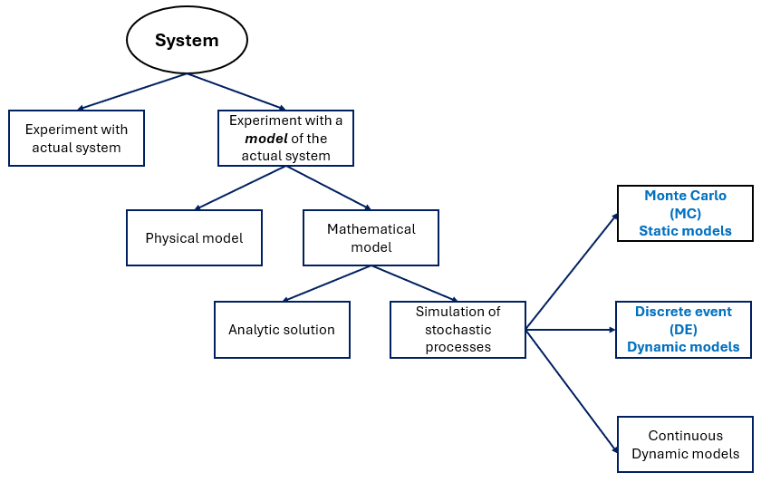
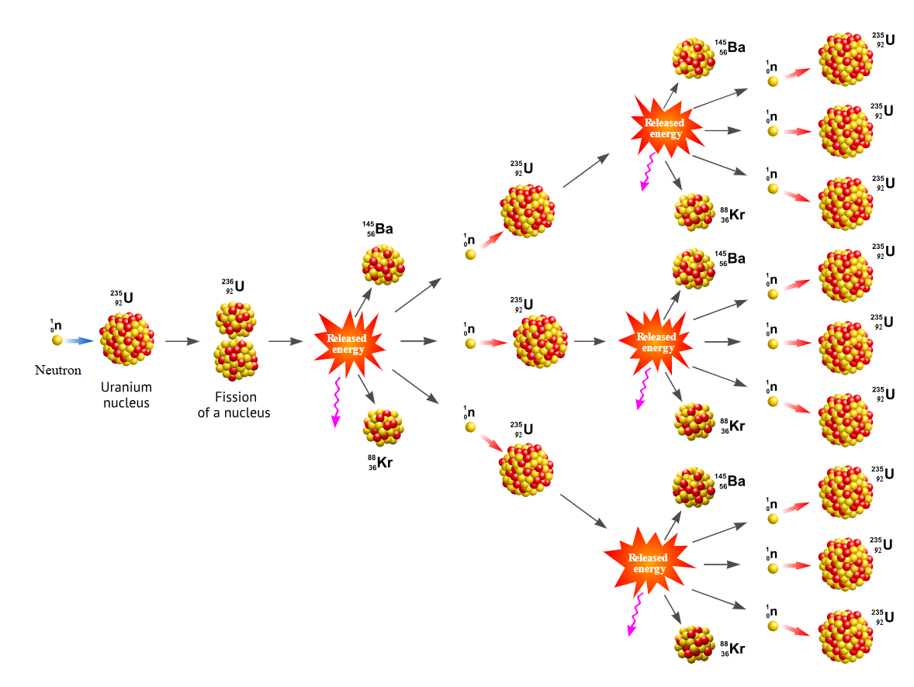

# Introduction to simulation {#ch:Intro}

> Remember that all models are wrong; the practical question is how wrong do they have to be to not be useful.
> 
> — George Box --- because he understood modeling deeply.

Simulation is a very important analytics tool for Industrial Engineering. In a broad sense, simulation is the emulation of real processes or systems over time. In this age, simulation is done with computer systems, data platforms, and software to represent and analytically evaluate the behavior of complex real-world systems efficiently. There are many definitions of simulation [@Tuncer2011]. However, in this book, we will define and learn the basic end-to-end process of creating and using models via Monte Carlo (MC) and Discrete Event Simulation (DES), which are two of the tools most used by industrial engineering practitioners. To do this, we will first explain and define some important concepts of systems and models.

## Systems

A system is defined as a set of interrelated components interacting to achieve a common objective. Systems are ubiquitous in engineering, management, and the natural sciences, encompassing everything from manufacturing plants to biological ecosystems and social organizations. The key characteristics and governing principles of systems, as related to simulation^[For a comprehensive description of thebvcharacteristics and governing principles of a system see @Bertalanffy1969, @NASASystemsENgHandbook2016, @Adams2014] are:

1.  **Interconnectedness**: Each component within a system influences and is influenced by other components. This mutual dependency is central to system behavior and often leads to emergent properties that cannot be understood by examining components in isolation.

2.  **Holism**: The system as a whole exhibits properties and behaviors that are not present in its individual parts. This principle underscores the necessity of studying systems in their entirety rather than as a collection of discrete elements.

3.  **Purpose**: Systems are goal-oriented, operating to fulfill specific functions or objectives. The purpose of a system guides its design, operation, and evaluation [@Leemis2006].

The study of systems can be approached by direct experimentation and models^[A model is the simplified version of a system. Models can be created and studied without dealing with all the complexity of real world systems. Its like making a mini-map of a city, it does not include every tree or building detail, but keeps the important parts so the user can understand how to get from one place to another.]:

- **Direct Experimentation:** Observing and manipulating the actual system to understand its behavior. While this approach provides real-world insights, it may be impractical, costly, or risky for complex or critical systems.

- **Model-Based Analysis:** Physical or mathematical representations of the system under study. These models allow controlled experimentation, hypothesis testing, and scenario analysis without the constraints imposed by real systems.

- **Analytical Models:** Mathematical representations^[Usually a set of equations.] that describe system behavior. These models are often limited to simple or idealized representations of a system due to the complexity of real-world phenomena.

- **Simulation Models:** The use of computational techniques to mimic the operation of systems over time, enabling the study of their dynamic and stochastic behavior under varied conditions.

::: {#fig-SysSim}
{width=100% alt="Representation of different types of systems, experimentation, models, and simulation." }

Relation of Systems, experimentation, models, and simulation.
:::

@fig-SysSim, adapted from @Law2000, presents the relation of systems and simulation modeling.

An elegant^[Elegance is the quality of a solution, proof or concept that combines simplicity, clarity, and depth while achieving correctness and generality. An elegant solution or model typically uses minimal assumptions, avoids unnecessary complexity, and often reveals unexpected connections or insights.] model will use the **principle of relevance from systems theory** [@Bertalanffy1969]. This principle states that when analyzing or modeling a system, the engineer should focus only on the elements, relationships, and variables that significantly affect the system's behavior or outcomes, while ignoring extraneous details. Thus, we ensure that our models remain manageable, meaningful, and useful without being overwhelmed by unnecessary complexity.

The key points of this principle, as related to simulation, are:

- **Definition of boundaries** to determine what is inside of the model and what belongs to the environment.

- **Selective focus** to include only variables that influence the goals and performance of the model.

- **Purpose driven** which states that relevance depends on the objective of the analysis.

## Processes and Systems

Processes are all related activities or parts inside a system that work together to make it function. Processes are subsets of systems, they are effective in what they do so the sytem can operate or run efficiently. A process is a specific sequence of actions or steps taken within a system to achieve a particular outcome, typically having a defined starting and ending point^[A simple test to determine if we are working with a system or a process is to ask if there is a start and an end. If the answer is "yes", we are dealing with a process.].

As you can see, modeling is about representing reality in an elegant way so we can predict, analyze, and improve performance without experimenting on the real system.

## Discrete Event Simulation

Real systems that exhibit stochastic and dynamic behavior over time are best represented by the creation of probabilistic models generating these stochastic mechanisms and observing the results of the model as time goes on. Considering the specific purpose of the simulation, there will be certain performance indicators of interest to be determined. Nevertheless, due to the evolution of our model over time, we need a logical arrangement of its parts and their interrelations: This is not a trivial task.

Discrete Event Simulation offers an elegant framework based on the idea of discrete events that help the observation of a model over time and the determination of key performance indicators of interest.

DES models a system where events happen at specific points in time, like customers arriving at a store or machines breaking down. This model also tracks how the system changes when these events occur.

We can formally define DES as a modeling technique in which the state^[A state is a collection of attributes or
variables that represent the entities of the system. For example, the number of parts produced, number of jobs in
progress, number of planes waiting to land, etc.] of a system changes only at discrete points in time, triggered by the occurrence of events^[An event is an instantaneous occurrence in time that alters the state of a system. For example; Arrival of a customer, a patient completing a treatment, a machine starting a job, a plane landing, etc.)]. At the same time, DES estimates the system's behavior when these events occur: the key performance indicators. Between events, the system's state remains constant [@Ross1990].

In summary, Discrete Event Simulation (DES) is a technique used to model complex systems where changes occur at discrete points in time. It is widely applied in manufacturing, healthcare, logistics, and service systems to analyze performance under uncertainty. Unlike deterministic models, DES incorporates randomness to mimic real-world variability, making statistical tools indispensable for both input and output analysis. These tools enable practitioners to design experiments, validate models, and interpret simulation results with rigor and confidence.

## Monte Carlo Simulation

Monte Carlo simulation is a method that uses random sampling to estimate outcomes when things are uncertain. Instead of calculating an exact answer, which might be impossible, an engineer runs the model many times with random inputs and see what happens on average. For example, to calculate the probability of winning a game of solitaire, the obvious and practical procedure will be to produce a large number of games and then calculate the relative proportion of games won.

Formally, Monte Carlo simulation is a computational technique that uses repeated random sampling from probability distributions to approximate solutions for mathematical or statistical problems that are difficult or impossible to solve analytically. It generates a large number of scenarios based on random inputs and applies statistical analysis to estimate outcomes, probabilities, or risk measures [@Metropolis1949].

The method was created when John vonNeumann and Stanislaw Ulam wanted to understand the behavior of neutrons in a nuclear explosion. They realized that directly calculating the complex movements of individual neutrons was impractical. Their innovative solution simulated many random neutron paths that they used to analyze overall trends and predict the efficiency of a nuclear fission reaction.

::: {#fig-Neutron}
{width=100% alt="Representation of of a nuclear explosion at the atom level." }

Behavior of neutrons in a nuclear explosion.
:::

@fig-Neutron illustrates the behavior of neutrons during a fission chain reaction [@Neutrons].

This book focuses on the practical modeling of real-world systems through Monte Carlo (MC) and Discrete Event Simulation (DES). To accomplish this, engineers must rely on their statistical knowledge to construct accurate models, explore scenarios that address "what-if" questions, and derive quantitative insights that support sound decision-making. These steps are essential for understanding system behavior and evaluating alternative strategies in complex environments. To prepare for effective simulation modeling, a solid foundation in statistics is indispensable. Concepts such as probability distributions, sampling methods, hypothesis testing, and confidence intervals play a critical role in ensuring that models reflect reality and produce reliable results. The following chapter provides a concise overview of these statistical principles and the tools most commonly used in simulation practice.

## Questions

1.  How is simulation defined in the context of Industrial Engineering according to the text?

2.  Why are computer systems and software essential in modern simulation practice?

3.  What are the two main simulation tools emphasized in this chapter for industrial engineers?

4.  Define a system as presented in the text.

5.  What does the concept of interconnectedness mean in systems theory?

6.  Explain the principle of holism and why it is important in system analysis.

7.  Why is purpose considered a fundamental characteristic of systems?

8.  What are the limitations of direct experimentation with real systems?

9.  How does a model differ from a real-world system?

10. What distinguishes analytical models from simulation models?

11. What is meant by an elegant model in the context of systems and simulation?

12. State and explain the principle of relevance from systems theory.

13. What are the three key points of the principle of relevance as applied to simulation?

14. How does the text distinguish between a system and a process?

15. What simple test is suggested to determine whether something is a process?

16. Why are stochastic and dynamic systems difficult to analyze analytically?

17. Define Discrete Event Simulation (DES) in formal terms.

18. What is a state in Discrete Event Simulation? Give an example.

19. What role do events play in DES models?

20. What is Monte Carlo simulation, and what historical problem motivated its development?

## Notes of the Introduction {#notes-of-the-introduction .unnumbered}

- George E. P. Box (October 18, 1919 --- March 28, 2013) was a British-born statistician and one of the most influential figures in modern statistics, experimental design, time-series analysis, and simulation-based modeling. Originally trained as a chemist, he taught himself statistics during World War II ---an experience that shaped his lifelong emphasis on real-world data over purely theoretical models. After the war, Box held prominent positions at Imperial Chemical Industries (ICI), Princeton University, and later founded the Department of Statistics at the University of Wisconsin--Madison. Box introduced or co-developed foundational tools such as the Box-Jenkins methodology, Box-Cox transformation, and response surface methods, bridging engineering practice, scientific modeling, and statistical theory. Box's famous aphorism---"All models are wrong, but some are useful."---was not meant as cynicism, but as encouragement. Box stressed that models should be iteratively improved through experimentation and simulation, not worshipped as exact representations of reality. He even titled his autobiography *An Accidental Statistician*, reflecting that he never planned to be a statistician at all---it "just happened" while solving practical engineering problems.

## References {#References .unnumbered}