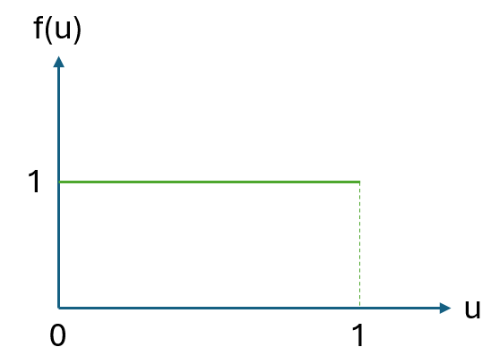
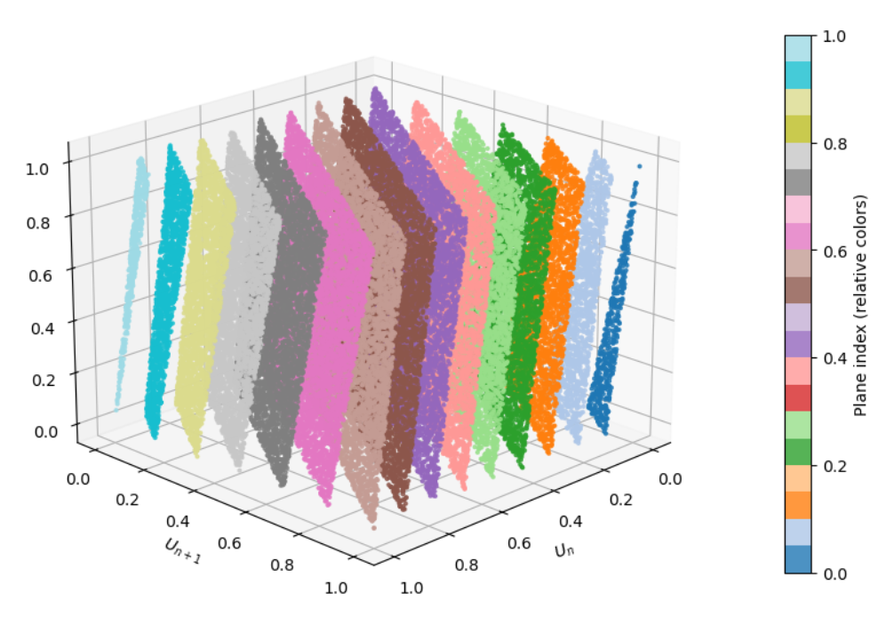

# Random and Pseudo-random numbers {#ch:Random}

<div style="float:right; width:100%; text-align:right; font-style: italic; margin: 20px 0;">

> Nothing is random, only uncertain.  
> — Gail Gasram

</div>
## Introduction

Simulation models need random numbers to represent the stochastic behavior^[Uncertainty and variability.] of real and complex systems. The first suggestion for an \"arithmetic generator\" of random numbers can be attributed to John vonNeumann and Nicolas Metropolis, in about 1946, as the \"middle-square\" method, where the next number in the sequence is obtained by using the middle digits of the square of the previous number. This was a method difficult to analize and not always producing satisfactory results, but runs of about 750,000 numbers were used successfully at Los Alamos for many years [@HullDobell1962].

True randomness is elusive in computational contexts^[If done carelessly.]. The great John vonNeumann^[Yes, the same one as above. vonNeumann studied in two different countries at the same time: He obtained a PhD in mathematics at the University of Budapest in Hungary, and a degree in Chemical Engineering at ETH Zurich in Switzerland. This achievement was the result of a compromise with his father, who wanted him to pursue a more lucrative career than pure mathematics, leading vonNeumann to study both fields concurrently. His contributions are broad: quantum mechanics, game theory, computing –he invented the vonNeumann architecture, the blueprint for almost all modern computers, worked at the Manhattan project and had contributions in cellular automata and self-replicating systems, to mention a few... and he developed duality in linear programming while Dantzig explained the simplex method to him.] famously remarked: "Anyone that considers arithmetical methods of producing random digits is, of course, in a state of sin. For, as has been pointed out several times, there is no such thing as a random number" [@vonNeumann1951]. Instead, simulations rely on pseudo-random number generators (PRNGs), which produce sequences of numbers that mimic randomness but are generated by creative deterministic algorithms.

is one that comes from a process where we do not know what the result will be, but we know the chances of each possible result. A simple example is the rolling of a fair die:

1.  *We do not know* which number (1 to 6) will come up.

2.  *We do know* that each number has an equal probability or chance of appearing: $\frac{1}{6}$

True random numbers come from unpredictable physical processes such as:

- Radioactive decay.

- Atmospheric noise.

- Thermal noise in electronic circuits.

These sources are used in hardware random number generators (HRNGs) to produce *truly random* numbers [@RFC4086], [@NIST80090B].

Computers do not generate truly random numbers but pseudo-random numbers (PRN). A PRN is generated by a deterministic algorithm^[Also called Pesudo Random Number Generator or PRNG, as pointed before.] that uses an initial value called a *seed*. While the numbers appear random, they are not *truly random* because:

1.  *They are predictable*: if you know the algorithm, and seed, you can predict all the sequence of random numbers produced by the generator^[This is one of the targets of black hat hackers.].

2.  *They are repeatable*: the same seed will always produce the same sequence of pseudo random numbers.

PNR's are widely used in software applications due to their speed and reproducibility. Specifically, we look for sequences of numbers that are long enough for practical simulations. During the rest of this material, when we refer to random numbers, we mean pseudo random numbers.

## Linear Congruential Generators: The creation of uniformly distributed pseudo-random numbers

A linear congruential generator (LNG)^[In simple terms, congruential methods use a congruence relation. A congruence relation is a special kind of equivalence relation that is also compatible with the operations of an algebraic structure. This means that if you have two elements that are congruent to each other, then performing any of the algebraic operations (such as addition, multiplication, etc.) on these elements will always result in equivalent elements.] is a sequence of uniformly distributed pseudo-random numbers $U_n$, for $n=0,1,2,\ldots$, that can be calculated by the generation of integers $I_n$ between zero and some integer $m$, and then computing the fraction $U_n=\frac{I_n}{m}$ to obtain a sequence of real positive random numbers in the real interval $[0,1)$ [@LauYu2018].

A LNG creates such a sequence of uniform values between zero and $m$ using the equation:

$$
    I_{n+1}=(aI_n+c) \bmod m
$$ {#eq-LCGBasic}

where:

- $I_0$ is the starting value or *seed*; $I_0\geq 0$ and integer.

- $a$ is the multiplier; $a\geq 0$ and integer.

- $c$ is the increment; $c\geq 0$ and integer.

- and $m$ is the *modulus*: $m\geq I_0$, $m\geq a$, $m\geq c$, and integer.

When $c=0$ and $m=2$, in @eq-LCGBasic, n-bit binary fractions $I_n$ can be generated [@Tausworthe1965]. Also, a LNG is called multiplicative if $c=0$^[Otherwise it is called mixed.], see @eq-LCGMult.

$$
    I_{n+1}=(aI_n) \bmod m
$$ {#eq-LCGMult}

The computational form of these LCG's illustrates a common characteristic of most procedures used to obtain a uniform distribution: the methods used to generate pseudo-random numbers are *deterministic*. One big advantage of deterministic methods is that they can be repeated, if necessary, during the construction of a simulation model.

In the case of the linear congruential method, the period^[The period of a PRNG is the number of outputs it generates before it starts to
repeat itself. It can be seen also as the length of a sequence of unique numbers that the PRNG can generate before cycling back to the beginning. The period sets the amount of randomness that a PRNG can generate.] of the sequence is dependent on both the multiplier $a$ and the increment $c$. @th-HD demostrated by @HullDobell1962 provides a means for obtaining the maximum, or full, period that can be defined by the congruence relation in @eq-LCGBasic. This is important because if $m$ is large, the sequence may take most of the representable values in the interval \[0,1).

::: {.theorem #th-HD}
<div style="text-align: justify;">
**Hull-Dobell Theorem.**  
The linear congruential sequence has a period of length $m$, or full period, if and only if:

1.  $c$ is a relative prime to $m$.

2.  $b=a-1$ is a multiple of $p$ for every prime $p$ dividing $m.$

3.  $b$ is a multiple of 4 if $m$ is a multiple of 4.
</div>

:::

Two integers are said to be relatively prime^[Relatively prime numbers are used in various areas of mathematics, including number theory, cryptography, abstract algebra, and random number generation.], also known as coprime, if their greatest common factor (GCF) is 1. In other words, two integers are relatively prime if they have no common factors other than 1. For example, 7 and 20 are relatively prime because their GCF is 1. This means that there is no integer that can divide both 7 and 20 evenly. Some properties of relatively prime numbers are:

- Any two consecutive integers are relative prime.

- A prime number is relative prime to any other integer that is not a multiple of that prime number.

- The LCM (least common multiple) of two relative prime numbers is equal to their product.

The conditions stated in Theorem ([\[th:HD\]](#th:HD){reference-type="ref" reference="th:HD"}) guarantee that the LCG will cycle through all possible values before repeating, giving the longest possible sequence. Obviously, if any condition fails, the generator will have a shorter period, reducing randomness quality.

These type of pseudo-random number generators can be created with very fast and deterministic calculations. They are easier to test and debug because the sequences repeat after a long period, and they can be reproduced if the starting point or seed of the sequence is known. They also need low memory and can be generated with code only^[They do not need external hardware.]. A PRNG is thus cost efficient for the creation of small and large simulation models.

## Properties of random numbers

A sequence of random numbers $u_i$; $\forall i=1,2,\dots,n$ must satisfy the following statistical and practical properties [@Lecuyer1990], [@NIST80090A], [@RFC4086], [@NIST80090B], [@Knuth1997]:

1.  *Uniformity,*: Each number $u_i$ must have the same probability of occurrence. This ensures unbiased sampling and fair representation.

2.  *Independency,* Each number $u_i$ should not depend on previous numbers. There should be no detectable autocorrelation^[Autocorrelation is the correlation of a sequence of numbers with a lagged version of itself. It quantifies the degree of similarity between observations as a function of the time lag between them. Mathematically, for a sequence of numbers $u_t$ , the autocorrelation at lag $k$ is $\rho(k)=\frac{Cov(u_t ,u_{t+k} )}{\sigma^2}$, where $Cov(u_t , u_{t+k})$ is the covariance between $u_t$ and $u_{t+k}$ and $\sigma^2$ is the variance of the sequence.]. Correlated random numbers distort statistical results and weaken cryptographic security^[Correlation includes redundancy, making the sample size smaller than expected. For example, if random numbers are positively auto-correlated, variability appears smaller than it is. This will cause type I errors or false positives because the statistical tests will consider data is more precise than it is.].

3.  *Long period*: The sequence of random numbers should not repeat itself for a very long time. This prevents cycles that bias a simulation or allow prediction of results.

4.  *High dimensional equi-distribution*: In $k-$dimensional space, tuples of successive numbers should fill the space uniformly. This is critical for Monte Carlo and Discrete Event simulations [@Marsaglia1968]^[MC samples random points $x$ uniformly across a region and takes the average of the transfer function $f(x)$. If tuples of successive random numbers $x_1, x_2, . . . , x_n$ do not fill the space uniformly, then some regions will be over-sampled and some others undersampled. This makes the estimations biased. This is a *systematic* error because results will deviate from the true value even if the samples are large. In DES random numbers drive event times, service durations, routing decisions and resource allocations. If random numbers are poorly distributed then certain events become more likely than others, system states cluster in unrealistic patterns, and performance metrics become biased.].

5.  *Unpredictability*: Future values cannot be predicted from past values. This property is essential for cryptographic applications.

6.  *Efficiency*: Random number generation should be fast and require minimal computing and storage resources. This is critical for large scale simulations of real systems.

7.  *Portability and reproducibility*: The same seed must produce the same sequence of random numbers across different computing platforms to ensure reproducible scientific and engineering simulations.

A good PRNG must balance statistical quality, security, and performance. For cryptography, unpredictability is paramount; for simulation, uniformity and independence dominate.

## Tests for Random Numbers

Traditional tests for random numbers verify uniformity and independence. The reason is that each random number $u_i$ should appear as if they were $IID$ $U(0,1)$^[IID: Identical and Independently Distributed drawn from a Uniform distribution between zero and one:
$U (0, 1)$.] random variates^[A random variate is the actual observed value generated from a random variable according to its probability distribution.]. This uniform density function is: 

$$
        f(u)=\left\{
        \begin{array}{ll}
            1 & 0 \leq u \leq 1\\
            0 & \textnormal{Otherwise}
        \end{array}
        \right.
$$

To verify that uniformity and independence are achieved, a battery of tests can be performed for each case. Table @tbl-testsRandom describes some of these tests and their purpose.

::: {#tbl-testsRandom}

| **Test**        | **Definition**                                                             | **Purpose**                  |
|:----------------|:---------------------------------------------------------------------------|:------------------------------|
| Runs           | Tests runs above or below the mean comparing actual vs. expected values   | Independence                 |
| Autocorrelation| Measures correlation between numbers separated by a fixed lag            | Independence                 |
| Frequency      | Compares the random numbers generated against a uniform distribution     | Uniformity                   |
| Spectral       | Examines lattice structure in $k$-dimensional space                      | Detects correlation in tuples|

: Example of randomness tests.

:::

The *pdf* function of an $IID$ $U(0,1)$ is presented in @fig-pdfRandom.

::: {#fig-pdfRandom}
{width=70% alt="Uniform random number probability graph from zero to one"}

**pdf** distribution $U(0,1)$.
:::

### Runs test for randomness

The @Wald1940 test, also known as the runs test for randomness, can be used to answer the following question: *Were these sequence data generated from a random process?* The hypotheses are:

$$
    \begin{array}{l}
        H_0:  \textnormal{The sequence is random}\\
        H_a:  \textnormal{The sequence is not random.}
    \end{array}
$$

The test codes values above the median as positive and values below the median as negative. A run is defined as a series of consecutive positive, or negative, values. The test statistic is defined as:

$$
    z=\frac{R-\bar{R}}{S_R}
$$

where $R$ is the observed number of runs, $\bar{R}$ is the expected number of runs, and $S_R$ is the standard deviation of the number of runs.

$$
    \bar{R}=\frac{2n_1n_2}{n_1+n_2}+1
$$

$$
    S_R^2=\frac{2n_1n_2(2n_1n_2-n_1-n_2)}{(n_1+n_2)^2(n_1+n_2-1)}
$$

$n_1$ and $n_2$ are the number of positive and negative values in the sequence. $H_0$ is rejected when $|z|>z_{1-\frac{\alpha}{2}}$.

In traditional statistical analyses where we have a limited amount of data (small sample size), it is common practice to set a significance level $\alpha$ in advance and reject $H_0$ when the $p$ value $<\alpha$ . Traditional values of significance are 0.001, 0.05, and 0.1. When testing random number generators, we can create larges amounts of data. This is, we control the sample size and can make any test more powerful such that we can arrive at a clear cut decision using the following strategy:

1.  If the outcome is clear, for example $p$ value $<10^{-10}$, reject $H_0$.

2.  If the $p$ value is suspicious --this is, close to the significance level, increase the sample size or repeat the test with other segments of the sequence.

In the majority of cases the suspicion will disappear or clear evidence against $H_0$ will show up quickly [@Banks1998].

When $H_0$ is not rejected, we can trust the random number generator, but can never prove it will behave correctly. In practical terms, it is better to run simulations twice, or more, using random number generators of different types if possible.

@lst-runs presents the runs test in python.

::: {#lst-runs}
::: {.callout-note title="Listing: Wald and Wolfowitz runs test in Python."}

```python
import numpy as np
from statsmodels.sandbox.stats.runs import runstest_1samp
import matplotlib.pyplot as plt

# Example data: n Uniform(0, 1) random numbers
np.random.seed(42) 
n=100
# set seed for reproducibility
x = np.random.uniform(0, 1, n) #generate 100 random numbers U(0,1)
print(x)

# Runs test: dichotomize x around its median and test randomness of the signs
z_stat, p_value = runstest_1samp(x, cutoff='median')  # alternative='two-sided' by default

print(f"Z statistic: {z_stat:.3f}")
print(f"p-value    : {p_value:.4f}")

# Simple interpretation helper
alpha = 0.05
if p_value < alpha:
print("Conclusion: Reject H0, there is evidence of nonrandomness in the sequence.")
else:
print("Conclusion: Fail to reject H0 there is no evidence against randomness.")
```
:::
:::

### Autocorrelation test

An autocorrelation test checks whether the values of a sequence of random numbers are related to their past values. It tries to answer the question: *Are successive values in a sequence correlated with each other?* If a sequence is random, each random number should be independent of previous ones, and the autocorrelation value is zero. If autocorrelation exists, then the sequence is not random.

Autocorrelation at lag $k$ is the correlation between random numbers $u_i$ and $u_{i-k}$.

$$\begin{equation}
    \hat{\rho}_k=\frac{\sum_{i=k+1}^n (u_i-\bar{u})(u_{i-k}-\bar{u})}{\sum_{i=1}^n (u_i- \bar{u})^2}
\end{equation}$$

where:

- $n$ is the sample size.

- $\hat{\rho}_k$ is the sample autocorrelation at lag $k$.

- $\bar{u}$ is the sample mean of the sequence.

- $k$ is the number of lags tested^[For a sequence, a common choice is $k = \sqrt{n}$. For small sequences $k$ should
be between 10 and 20.].

@Ljung1978 provide a good test with hypotheses:

$$\begin{equation}
    \begin{array}{l}
        H_0:  \textnormal{The sequence is independently distributed}\\
        H_a:  \textnormal{The sequence is not independent}
    \end{array}
\end{equation}$$

In formal terms, for a lag $k$:

$$\begin{equation}
    \begin{array}{l}
        H_0:  \rho_1=\rho_2=\ldots=\rho_k=0\\
        H_a:  \exists i \in 1,2,\ldots,k: \rho_i\neq 0
    \end{array}
\end{equation}$$

with test statistic: $$\begin{equation}
    Q=n(n+2) \sum_{i=1}^k\frac{\hat{\rho}_i^2}{n-i}
\end{equation}$$

Under the null ($H_0$): $Q \sim \chi^2(k)$. Therefore, for a significance level $\alpha$, reject $H_0$ when $Q>\chi_{1-\alpha}^2$.

@lst-ljung presents an example, and code, of the Ljung-Box test in python.

::: {#lst-ljung}
::: {.callout-note title="Listing: Ljung-Box autocorrelation test in Python."}

```python
    
    import numpy as np
    import matplotlib.pyplot as plt
    from statsmodels.graphics.tsaplots import plot_acf
    from statsmodels.stats.diagnostic import acorr_ljungbox
    
    # Step 1: Generate random Uniform(0,1) data
    np.random.seed(42)  # for reproducibility
    x = np.random.uniform(0, 1, 200)  # 200 random points
    print(x)
    # Step 2: Autocorrelation plot ---
    fig, ax = plt.subplots(figsize=(8, 4))
    plot_acf(x, lags=20, ax=ax, alpha=0.05)
    ax.set_title("Autocorrelation Plot for Uniform(0,1) Sequence")
    plt.tight_layout()
    plt.show()
    
    # Step 3: Ljung Box test for autocorrelation
    # Null hypothesis: data are independently distributed (no autocorrelation)
    lb_test = acorr_ljungbox(x, lags=[10, 20], return_df=True)
    print("Ljung Box Test Results:",lb_test)
```
:::
:::


### Frequency test

The Frequency (Monobit) test developed by NIST^[National Institute of Standards and Technology.] and published in @NIST800221A2010 checks whether the number of ones and zeros^[Or more generally, values above or below a threshold.] in a random sequence are approximately equal. For a continuous random uniform distribution with numbers in the interval \[0,1) the threshold is 0.5. This is, values above or equal to 0.5, and values below 0.5. Thus, the question we try to answer is: *Does each possible random number outcome occur with roughly the expected proportion or frequency as stated by a uniform distribution?* The hypotheses are: $$\begin{equation}
    \begin{array}{l}
        H_0:  \textnormal{The sequence is random in terms of frequency.}\\
        H_a:  \textnormal{The sequence is not random in terms of frequency.}
    \end{array}
\end{equation}$$

For a binary sequence of length $n$, derived from U(0,1) with threshold at 0.5, the normalized test statistic is:

$$
    S_{obs}=\frac{|n_1-n_0|}{\sqrt{n}}
$$

where:

- $n_1$= number of ones (values $\geq 0.5$)

- $n_0$= number of zeros (values $<0.5$)

- $n=n_1+n_0$

The $p$ value is computed using the complementary error function:

$$
    p=\textnormal{erfc}\bigg(\frac{S_{obs}}{\sqrt{2}}\bigg)
$$

where:

$$
    \textnormal{erfc}(x)=\frac{2}{\sqrt{\pi}}\int_x^\infty e^{-t^2}dt
$$

The complementary error function, $\textnormal{erfc}(x)$, measures the tail probability of a Gaussian distribution scaled by $\sqrt{2}$. In randomness tests, it converts a normalized test statistic into a $p$ value under the assumption of normality.

After choosing a significance level $\alpha$:

- If $p$ value $>\alpha$, fail to reject $H_0$.

- If $p$ value $\leq \alpha$, reject $H_0$.

@lst-Mbit presents an example and python code of the Frequency-Monobit test.

::: {#lst-Mbit}
::: {.callout-note title="Listing: Frequency (Monobit) test in Python."}

```python
    import numpy as np
    import matplotlib.pyplot as plt
    from math import sqrt, erfc
    
    def frequency_test(x):
    """
    Frequency (Monobit) Test for randomness.
    Converts values to bits: 1 if >= 0.5 else 0.
    Returns test statistic and p-value.
    """
    n = len(x)
    bits = np.where(x >= 0.5, 1, 0)
    s_obs = abs(np.sum(bits) - np.sum(1 - bits)) / sqrt(n)
    p_value = erfc(s_obs / sqrt(2))
    return s_obs, p_value, bits
    
    # Generate Uniform(0,1) random numbers
    np.random.seed(42)
    x = np.random.uniform(0, 1, 1000)
    
    #  Run Frequency Test 
    stat, p, bits = frequency_test(x)
    print(f"Frequency Test Statistic: {stat:.4f}")
    print(f"p-value: {p:.4f}")
    if p <= 0.05:
    print("Reject H0: Evidence of non-randomness")
    else:
    print("Fail to reject H0: No evidence against randomness")
```
:::
:::

### Spectral tests: \"Diehard\" and Marsaglia

Testing of random number generators was considered a very empirical and heuristic activity where the main idea of testing was to seek situations where the behavior of some output was significantly different from the expected behavior of uniform random variables U(0,1).

In 1968 George @Marsaglia1968 published a paper exposing a fundamental flaw in the most widely used pseudo-random number generators of the time: the multiplicative congruential generator (MCG), first suggested by @Lehmer1951. This generator produces random numbers by repeatedly multiplying an integer by a constant and taking the remainder after division by a modulus. While these generators were praised for their long cycles and good statistical properties in one dimension, Marsaglia revealed a hidden "crystalline" regularity in higher dimensions. The core finding was that if you take n-tuples of successive outputs from such a generator and plot them as points in an n-dimensional unit cube, all the points will lie on a surprisingly small number of parallel hyperplanes as depicted in @fig-Hypers. This is not a minor artifact: the regularity is so pronounced that the points are as orderly as atoms in a perfect crystal at absolute zero. Marsaglia proved this rigorously in @th-Marsaglia, using number theory and geometry of numbers, showing that for any modulus and multiplier there exists a set of integer coefficients such that all n-tuples fall into at most a calculable number of planes. He provided explicit bounds for the number of planes for common computer word sizes (e.g., for 32-bit words, all 10-tuples fall into fewer than 41 planes). Marsaglia's theorem is general: it applies to all multiplicative and mixed congruential generators, regardless of the choice of multiplier, modulus, or seed. His proof leverages Minkowski's theorem from the geometry of numbers, showing that the structure is unavoidable.

::: {#fig-Hypers}
{width=70% alt="Hyperplanes generated by triplets of random numbers."}

Hyperplanes of RANDU with seed=1, a=65539, and m=2**31.
:::


::: {.theorem #th-Marsaglia}

<div style="text-align: justify;">

**Marsaglia's Theorem.**
[]{#th:Marsaglia label="th:Marsaglia"} Let $\{u_n\}$ be a sequence generated by a linear congruential generator (LCG): $u_{n+1} = (a\times u_n + c) \bmod m$. When points $(u_n,u_{n+1}, \dots, u_{n+k-1})$ are plotted in $k$-dimensional space, they lie on at most $\big(k!\,m\big)^{1/k}$ parallel hyperplanes. This lattice structure shows that LCGs---especially multiplicative ones ($c=0$) ---are not truly random in higher dimensions.
</div>
:::

Marsaglia's work was a turning point in the theory and practice of random number generation. Its relevance is profound for several reasons:

1.  *Revealed hidden correlations*: The discovery that n-tuples from LCGs lie on a small number of planes means that these generators can produce highly correlated outputs in higher dimensions. This undermines their suitability for Monte Carlo, DES, and other applications requiring genuine randomness in multidimensional spaces.

2.  *Set new standards*: Marsaglia's analysis led to the development of the *spectral test*, which became a standard criterion for evaluating random number generators. The test measures the maximum distance between these planes, and a good PRNG should have points that fill the space more uniformly, not just lie on a few planes.

3.  *Guided the design of better PRNG's*: This discovery motivated the search for new algorithms that avoid this defect. Modern generators, such as the Mersenne Twister [@Matsumoto1998], WELL [@Panneton2006], and combined multiple recursive generators^[CMRGs] [@Lecuyer1988e], are explicitly designed to pass the spectral test^[The term comes from spectral analysis that studies the spectrum of a matrix or operator: its eigenvalues. In this context, the test uses the spectral norm of a certain matrix derived from the PRNGs modulus and multiplier to compute the shortest distance between hyperplanes. Its called spectral because the calculation involves norms and eigenvalues: concepts from spectral theory in mathematics.] and avoid the plane structure.

4.  *Impacted scientific computing:* Marsaglia's warning about the potential for "bad, but unrecognized, results" in Monte Carlo and DES simulations led to a reevaluation of decades of computational work. It highlighted the need for rigorous testing and theoretical analysis of random number generators, not just empirical checks^[This is of special importance in this era of Big Data Analytics and AI.].

5.  *Established a mathematical foundation:* By connecting random number generation to deep results in number theory and geometry, Marsaglia's work provided a mathematical foundation for the field, enabling systematic analysis and improvement.

In the 1990's, Marsaglia developed *Diehard*, a battery of statistical tests for random number generators. Their purpose is to rigorously evaluate the quality of PRNGs by subjecting their output to a wide variety of statistical challenges [@marsaglia1995diehard] and [@marsaglia_cdrom_diehard]. If a PRNG consistently passes these tests, it is considered to have good statistical properties for practical use^[There is a modern version of tests called Dieharder at Duke [@dieharder].].

The Diehard suite includes tests such as:

- *Birthday Spacings Test:* Checks for collisions in randomly chosen birthdays, revealing non-uniformity.

- *Overlapping Permutations Test:* Examines sequences for the expected frequency of permutations.

- *Ranks of Matrices Test:* Evaluates the ranks of random binary matrices.

- *Monkey Tests:* Simulates random typing to check for expected patterns.

- *Count-the-1's Test:* Counts the number of ones in random bit streams.

- *Parking Lot Test:* Simulates random placement of objects to check for clustering.

- *Minimum Distance Test:* Measures the minimum distance between random points in a square.

- *Random Spheres Test:* Places spheres randomly and checks for overlaps.

- *Squeeze Test:* Applies a mathematical "squeeze" to random numbers.

- *Craps Test:* Simulates the dice game craps to check for expected outcomes.

Each test is designed to detect specific types of non-randomness or correlations that might be present in a PRNG's output. The suite produces $p$ values for each test.

The *Diehard* tests became a standard benchmark for PRNGs. Passing *Diehard* or *Dieharder* is not a guarantee of cryptographic security, but it is a strong indication that a generator is suitable for scientific simulations, Monte Carlo, DES, and other applications where statistical randomness is required.

## Modern PRNGs in commercial and scientific software

@tbl-prngsoft presents PRNGs used by commercial and open-source scientific software for Monte Carlo (MC) and discrete-event simulation (DES)^[Obtained from online documentation of each app and software.].

::: {#tbl-prngsoft}

| **Software or App** | **Main PRNG**                              | **Alternatives** |
|--------------------|--------------------------------------------|------------------|
| Python             | Mersenne-Twister (MT19937)                | Cryptographic PRNG with hardware entropy |
| R                  | Mersenne-Twister                          | Wichmann-Hill, Marsaglia-Multicarry, Super-Duper |
| Excel (2010+)      | Mersenne-Twister                          | Earlier versions used Wichmann-Hill |
| C++                | Mersenne-Twister (MT19937)                | MT19937-64, LCG, subtract-with-carry |
| MATLAB             | Mersenne-Twister (seed 0)                 | DSFMT, MRG32k3a, Philox, Threefry |
| MINITAB            | Proprietary                               | Mersenne-Twister (MT19937), LCG |
| SIMIO              | Mersenne-Twister (MT19937)                | LCG, CMRG |
| ARENA              | Mersenne-Twister (MT19937)                | Wichmann-Hill |
| Crystal Ball (CB)  | Multiplicative Congruential Generator (MCG) | Uses milliseconds since Windows start if no seed provided |
| \@Risk              | Mersenne-Twister                          | MRG32k3a, MWC, KISS, LFIB4, SWB, KISS-SWB, RAN3I |

: PRNGs used by simulation software and computer languages.

:::

Mersenne-Twister is the most popular PRNG [@Matsumoto1998]. The algorithm uses a state size based on a Mersenne prime^[Discovered by the French mathematician Marin Mersenne in 1644 and published in Cogitata Physico-Mathematica, this prime number has the form: $2 p − 1$, where $p$ is also a prime number. Not every number of the form $2 p − 1$  is prime, but when it is, then is a Mersenne prime.]: $2^{19937}-1$, providing a huge period. \"Twister\" refers to the way it scrambles the bits in its internal state to ensure randomness.

Crystal-Ball, a commercial MC app that works as add-in in Excel, uses the random number generator described in @eq-cball as the basis for all nonuniform generators. For no starting seed value, Crystal Ball takes the value of the number of milliseconds elapsed since Windows started.

$$
    r_{n+1}=62089911r_n \textnormal{ mod }(2^{31}-1)
$${#eq-cball}

The generator has a period that makes the cycle of random numbers repeat after several billion trials [@Knuth1997].

Python uses hardware entropy^[Hardware entropy means a seed obtained when the computer gathers tiny unpredictable signals from the real
world: Electrical noise in circuits, timing variations in CPU operations, mouse movements, or disk activity. These signals are chaotic and hard to predict, so they provide true unpredictability. The operating system collects this noise and turns it into a pool of random bits.] as seed for secure randomness in cryptography^[Using `os.urandom`, or the `secrets` modules.] and supports advanced parallel RNG features through `Numpy’s Generator` with `SeedSequence` and Phylox^[Phylox is a PRNG that uses cryptography. Similar to Threefry --this last not suitable for cryptographic applications.] counter-based RNG [@python_secrets], [@numpy_philox], [@salmon2011_random123].

The interested reader can look at [@r_random_doc], and [@Marsaglia2003] for most of the RNG's mentioned in @tbl-prngsoft

## Conclusions

Simulation results can be subtly biased by PRNG flaws, leading to incorrect conclusions in sensitive domains such as finance, physics, cryptography, defense system's modeling, and high stakes manufacturing. The general recommendation for critical simulations is to *use multiple, well tested PRNGs and validate them with statistical tests.*

Some of the best practices to implement are:

- Use PRNGs with proven statistical properties. They should pass strong batteries like Diehard or Dieharder.

- Avoid simple linear congruential generators (LCGs). They are fast, but exhibit lattice structures and poor high-dimensionality behavior.

- Consider cryptographically secure PRNGs for security simulations. This will be a trade-off between speed and security.

- Document your seeds and algorithms for reproducibility.

- Critical simulations often require billions of random numbers, using PRNGs with long periods is better.

## Questions 

1.  Why are random numbers essential in simulation modeling?

2.  What was the middle‑square method, and who proposed it?

3.  Why is true randomness difficult to achieve in computational systems?

4.  What is John von Neumann's critique of arithmetical methods for generating random numbers?

5.  What defines a truly random number? Give one illustrative example from the text.

6.  What physical processes can be used to generate truly random numbers?

7.  What is the difference between true random numbers and pseudo‑random numbers (PRNs)?

8.  What are the two fundamental properties that make PRNs useful in simulation?

9.  What is a seed in a pseudo‑random number generator, and why is it important?

10. Define a Linear Congruential Generator (LCG) and write its general recurrence equation.

11. What is the difference between a mixed LCG and a multiplicative LCG?

12. What is the period of a pseudo‑random number generator, and why is it important?

13. State the three conditions of the Hull--Dobell Theorem for a full‑period LCG.

14. What does it mean for two integers to be relatively prime? Give an example.

15. List and describe three key statistical properties that a good sequence of random numbers must satisfy.

16. Why is independence crucial for random numbers used in Monte Carlo and DES simulations?

17. What is the purpose of randomness tests such as runs, autocorrelation, and frequency tests?

18. What is the null hypothesis in the Wald--Wolfowitz runs test?

19. What flaw in linear congruential generators was revealed by George Marsaglia?

20. Why is the Mersenne Twister widely used in modern scientific and simulation software?

### Exercises

1.  **Conceptual.** Explain why computers cannot generate truly random numbers and why this limitation is acceptable for simulation modeling.

2.  **True vs Pseudo Randomness.** List three differences between true random numbers and pseudo‑random numbers and explain why pseudo‑random numbers are preferred in simulation studies.

3.  **Linear Congruential Generator.** Given: $$I_{n+1}=(5I_n +3)\, mod\, 16$$ with seed $I_0=7$. Compute $I_1$, $I_2$, $I_3$ and the corresponding $U_n$.

4.  **Mixed vs Multiplicative LCG.** Explain the difference between:

    1.  A mixed LCG

    2.  A multiplicative LCG

    Why might one prefer a mixed generator?

5.  **Hull--Dobell Conditions.** Given $m=20$, $a=7$, and $c=3$, determine whether the LCG satisfies the Hull-Dobell theorem for a full period.

6.  **Period and Simulation Risk.** Explain what the period of a PRNG is and describe one risk of using a generator with a short period in Monte Carlo simulation.

7.  **Properties of Random Numbers.** From the list below, identify which property is violated in each case:

    1.  Successive random numbers show strong positive autocorrelation

    2.  Numbers repeat after 10,000 values

    3.  Generated values cluster in planes in 3‑D space

    4.  Numbers are uniformly distributed but predictable from the seed

8.  **Runs Test Reasoning.** What is the null hypothesis of the Wald--Wolfowitz runs test? Explain what it means to reject this null hypothesis.

9.  **Autocorrelation Interpretation.** In an autocorrelation test at lag $k=10$, the Ljung--Box statistic exceeds the critical chi‑square value at $\alpha = 0.05$. What conclusion should be drawn about the random number sequence?

10. **Marsaglia's Spectral Result.** Explain in your own words why Marsaglia's hyperplane result makes simple Linear Congruential Generators unsuitable for Monte Carlo simulation.

## Notes of the Chapter {#notes-of-the-chapter .unnumbered}

- George Marsaglia (1924--2011), Professor Emeritus of Statistics at Florida State University and a legendary figure in computational statistics and random number generation, occasionally used the pseudonym "Gail Gasram" (his name spelled backward) when publishing or contributing to certain works, particularly informal notes, discussions, or software-related content.

## References {#References .unnumbered}
