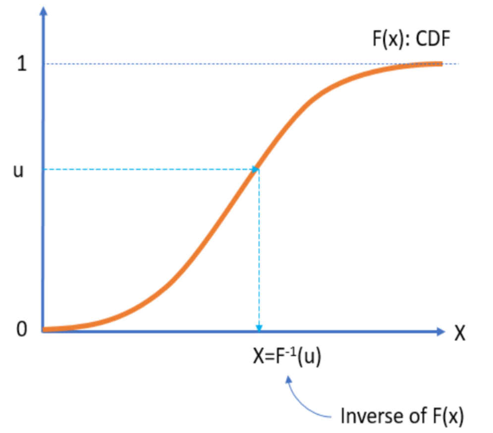
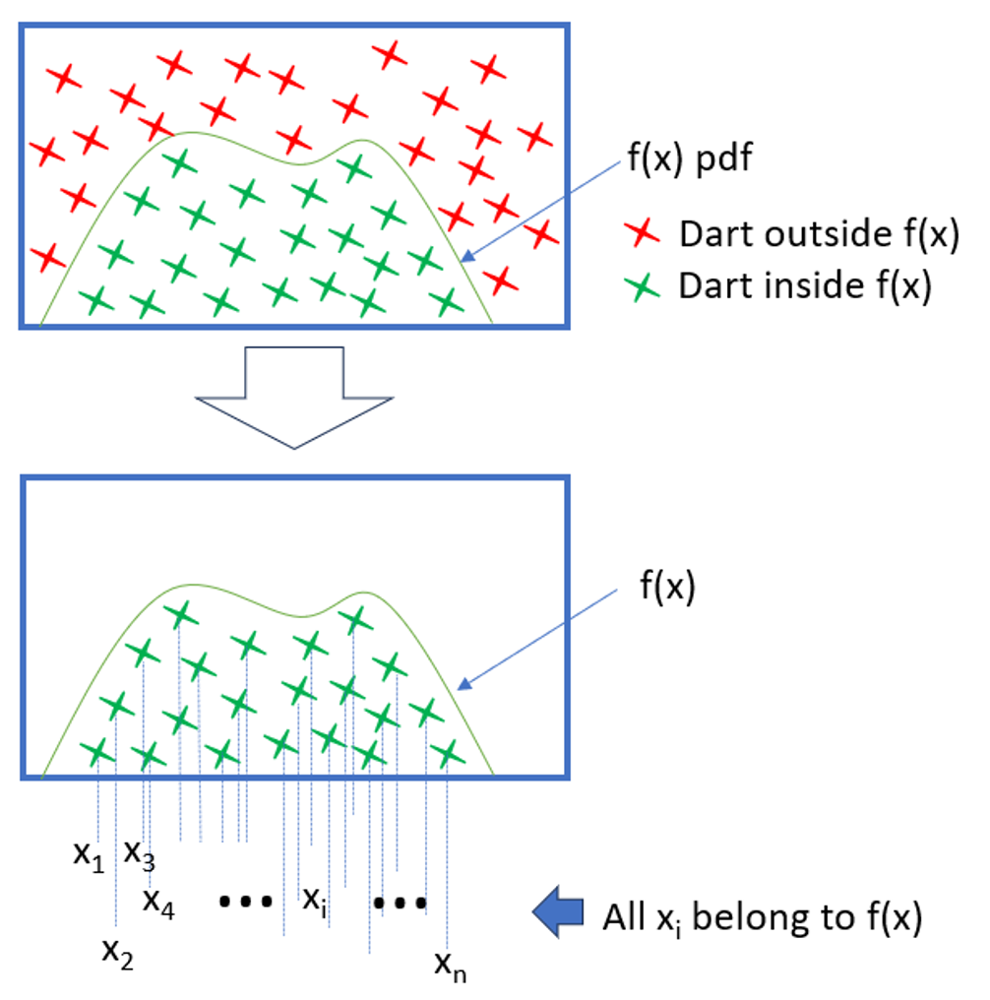
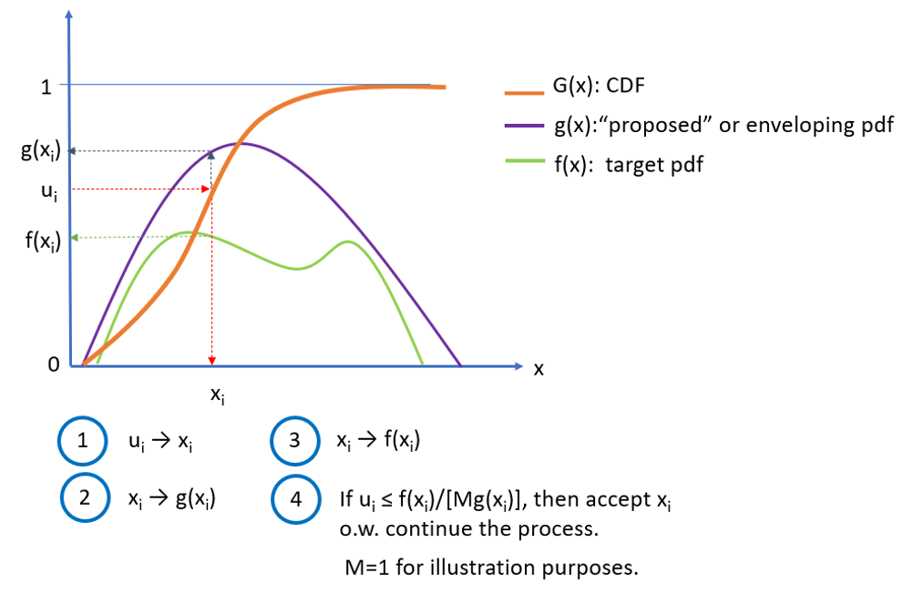
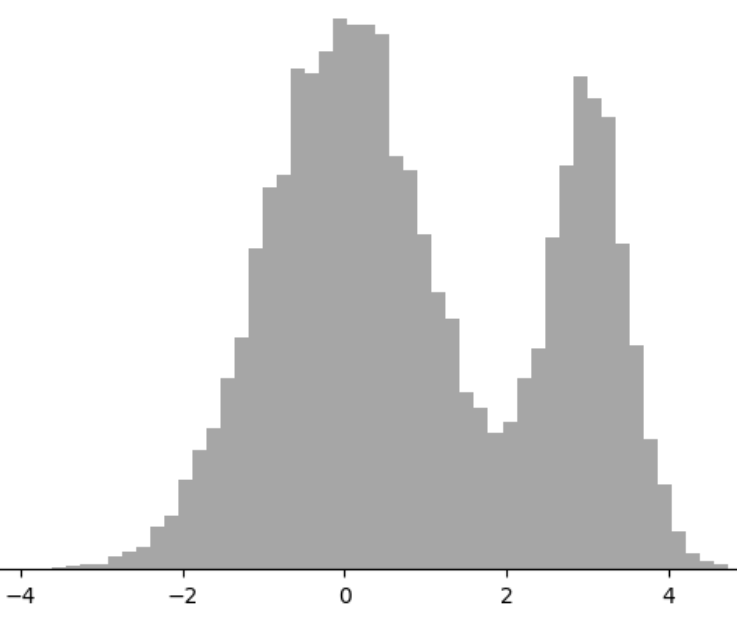
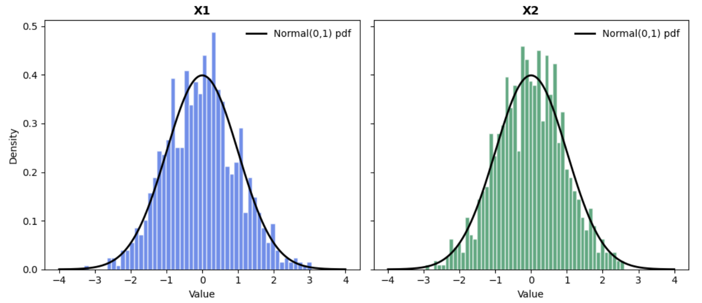
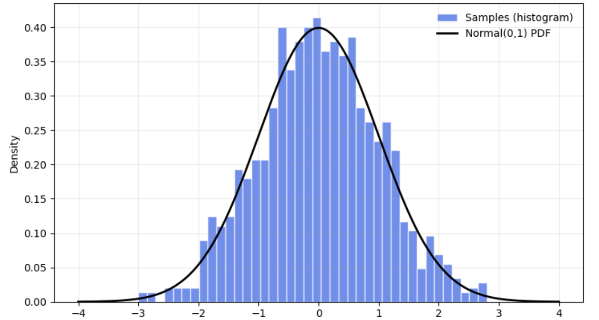

# Generating probability distributions {#ch:genProbDist}

<div style="float:right; width:100%; text-align:right; font-style: italic; margin: 20px 0;">

> I can live with doubt and uncertainty.  
> — Richard Feynman

</div>


## Introduction

Monte Carlo (MC) and discrete‑event simulation (DES) rely on sampling random variables that encode uncertain behaviors: Service times, failures, arrivals, market shocks, particle collisions, etc. Reliable generation of the right probability distribution avoids biases, misleading confidence intervals and decisions, etc. This chapter will cover methods for the generation of probability distributions from $U(0,1)$ PRNGs.

## Canonical approaches to generate random distributions

The term *canonical* in statistics refers to a standard or natural form of expressing relationships or models. A canonical method typically involves transforming data or models into a preferred form for easier interpretation and analysis. The common characteristic of these methods is the generation of random variates beginning with $U(0,1)$ PRNGs and transforming them into the target distribution using mathematical techniques. Some of the most used in simulation are:

1.  **Inverse transform**. This method is conceptually clean because it *bends* and *stretches* $U(0,1)$ random numbers to fit random variates of the target distribution needed. The performance of this approach hinges on how fast the evaluation of the inverse of the target distribution $F^{-1}$ can be done.

2.  **Convolution**^[Convolution is a mathematical operation that combines two functions to produce a third one, showing how the shape of one function influences or modifies the other.]. This method is applied when a complex probability distribution can be expressed as the sum of several independent random variables. In this approach, random variates are first generated from each of the component distributions, and then these values are added together to produce a sample from the target distribution. This works because the distribution of the sum corresponds to the convolution of the component distributions.

3.  **Acceptance-Rejection**. This is a procedure to generate random numbers, from a complicated target distribution, using a simpler one that *envelops* the complex target distribution. This method is universal and its efficiency is dependent in the selection of the enveloping function^[The best enveloping functions are the ones that provide *tighter* enveloping.].

4.  **Composition or Mixture**. Very useful when the target distribution can be expressed as a **mixture** or **composition** of simpler distributions^[The requirement of *sum of independent random variables does not apply here*, in this case, the target is just a mixture of simpler distributions.].

5.  **Specialized methods for normal distributions**. Algorithms developed by @Box1958 and the polar method by @Marsaglia1964 will be covered.

A random variate is the realization or specific outcome of a random variable that follows a probability distribution. The process to generate a random variable $x$ with cumulative distribution function as described in @eq-FPr, needs a PRNG $U(0,1)$.

$$
    F(x)=Pr(X\leq x) \textnormal{;      } -\infty <x < \infty
$$ {#eq-FPr}

Most simulators have routines that generate these probability distributions automatically. In general, four factors should be considered when selecting a random variate generator [@Banks1998].

1.  *Exactness:* A generator is exact if the distribution of variates generated has the form desired. In engineering applications, where the precise distribution might not be critical, a method that only approximates the desired distribution will be acceptable.

2.  *Speed:* Related to the computing time required to generate the variate. There are two components: the initial set-up time to create constants and tables needed, and the actual time to calculate the variate.

3.  *Space:* Computer memory requirements for the generator. These are usually small when compared to the total memory needed for a simulation model.

4.  *Simplicity:* Refers to the algorithmic and implementation complexity. A generator easier to code and understand will be preferred to a more complicated alternative, as long as they generate equivalent variates.

With the use of modern simulation software, doing something useful with the generated random numbers will usually take much longer than generating them, fairly small differences in speed or space between algorithms are, in general, of no practical consequence. Thus, when generating random variates, *the emphasis is on simplicity and long full periods*.

### Inverse method

The is one of the simplest methods and relies on the following theorem that assumes the inverse probability exists in closed form:


::: {.theorem #th-inverseth}
<div style="text-align: justify;">
**Inverse Transform Theorem.**  
*Let $x$ be a variable with cumulative distribution function $F(x)$, monotonic and invertible. Then, for any random variable $u \sim U(0,1)$, the random variable $X = F^{-1}(u)$ has the same distribution as $x$ [@vonNeumann1951; @Devroye1986].*
</div>
:::


The graphical representation of @th-inverseth is presented in @fig-Inverse.

::: {#fig-Inverse}
{width=50% alt="Graphical representation of the inverse method. Starting from the y-axis with a random number u and ending with a value X that follows a distribution F(x)"}

Graphical representation of the inverse method.
:::

@th-inverseth is the basis of an algorithm for the generation of random variates as long as the inverse cumulative distribution can be defined analytically:

1. Obtain the cumulative distribution function (CDF) $F(x)$.

2. Replace $F(x)$ with $u$ and $X$ for $x$.

3. Solve for $X$$.


### Example: Inversion method for the Exponential cumulative distribution {#Example .unnumbered}

1.  The CDF of an exponential distribution is: $F(x,\lambda)=1-e^{-\lambda x}\:\: \forall \, \lambda>0;\, x\leq 0$.

2.  Replacing $u$ and $X$: $u=1-e^{\lambda X}$.

3.  Solving for $X$: $X=-\frac{1}{\lambda}ln(1-u)$

It is easy to see that $1-u \sim  u$. Therefore, we simplify the solution to $X=-\frac{1}{\lambda}ln(u)$.

@lst-inverseexp presents the python code implementing this transformation and generating 10,000 random variates.

::: {#lst-inverseexp}
::: {.callout-note title="Listing: Inverse method for exponential distribution in Python."}

```python
    
    import numpy as np
    import pandas as pd
    import matplotlib.pyplot as plt
    
    def expo(lambd, n):
    x=pd.Series((np.log(np.random.rand(n))/lambd)*(-1))  
    # Note: np.random uses Mersenne-Twister
    return x
    
    # Plot histogram
    
    plt.hist(expo(lambd=1, n=10000), bins=60)
    plt.ylabel("Frequency")
    plt.title("Histogram of exponential random numbers with lambda=1")              
    plt.show()
```
:::
:::

### Example: Random variate generation for the Bernoulli distribution {#Example .unnumbered}


1.  The probability mass function (PMF) is: $$P(X=1)=p, \,\,\, P(X=0)=1-p$$

2.  Beunoulli's Cumulative Distribution Function (CDF): $$F(x)=\left\{
            \begin{array}{ll}
                0 & x < 0\\
                1-p & 0 \leq x <1 \\
                1 & x\geq 1
            \end{array}
            \right.$$

3.  Generate $u \sim U(0,1)$.

4.  If $u\leq 1-p$, then $X=0$; else $X=1$.

### Exercise: Geometric distribution {#Exercise .unnumbered}


Generate 100,000 random variates for the Geometric Distribution. This discrete distribution answers the question: *How many trials ($k$) will it take before a process has a success for the first time when the probability of success for each trial is $p$?* Its all about counting the number of attempts until the first success.

## Convolution method

The convolution method is used to generate random variates from a distribution that can be expressed as the sum of independent random variables. Instead of sampling directly from the complicated distribution, sample from its components and add them up. @th-convolution provides the supporting principle for this method:

::: {.theorem #th-convolution}
<div style="text-align: justify;">
**Convolution Theorem.**  
*Let $x$ be a random variable such that $x=x_1+x_2+ \ldots, +x_n$, where $x_i$ are independent random variables with known distributions. Then, the distribution of $x$ is the **convolution** of the distribution of $x_i$. To generate $x$, sample each $x_i$, and sum: $x=\sum_{i=1}^n x_i$ [@Devroye1986].*
</div>
:::


The assumptions that must be satisfied are:

- The target distribution can be represented as a sum of independent distributions.

- Each component distribution is known and can be sampled efficiently^[Using the inverse, acceptance-rejection,
or other methods.].

- All component distributions are independent of each other.

The convolution method shines when the target distribution has a natural sum structure^[For example: Erlang or Gamma
distributions with integer shape, sums of normal distributions, etc.]. However, if the target distribution is not a clean sum of independent parts, we need to consider other methods.

### Example: Convolution method for Erlang distribution {#Example .unnumbered}


The Erlang distribution^[The Erlang distribution is widely used in fields where events occur randomly over time and the engineer models the waiting time of multiple events. It has uses in queuing theory, reliability and life testing, insurance and risk analysis, simulation of Poisson processes, traffic engineering, etc.] with parameters of shape ($k \in \mathbb{N}$), and rate ($\lambda>0$), is presented in @eq-ErlangPDF and @eq-Erlang as PDF and CDF respectively.

$$
    f(x; k, \lambda)=\left\{
    \begin{array}{ll}
        \frac{\lambda^k \cdot x^{k-1 }\cdot e^{-\lambda \cdot k}}{(k-1)!} & x \geq 0\\
        0& x < 0  
    \end{array}
    \right.
$$ {#eq-ErlangPDF}

$$
F(x; k, \lambda)=\left\{
    \begin{array}{ll}
        1- \sum_{n=0}^{k-1} \frac{e^{-\lambda x}\,(\lambda x)^n}{n!} & x \geq 0\\
        0 & x < 0  
    \end{array}
\right. $$ {#eq-Erlang}

These formulas come from the fact that the Erlang distribution is the sum of $k$ independent exponential random variables with rate $\lambda$.

Thus, the procedure to generate Erlang variates is:

1.  Understand the structure. The Erlang distribution can be expressed as: $$x=E_1+E_2, \ldots, +E_k$$ where each $E_i$ are independent exponential distributions with parameter $\lambda$.

2.  For each $i=1,2,\ldots, k$, generate random variables $E_i$. using the *inverse transform method*: $$E_i=-\frac{1}{\lambda}ln(u_i), \,\,\,u_i \sim U(0,1)$$

3.  Sum the components: $$x=\sum_{i=1}^{k} E_i$$

4.  Repeat steps 2 and 3 for as many random variates as needed.

@lst-converlang presents the python code to generate Erlang random variates using the convolution method.


::: {#lst-converlang}

::: {.callout-note title="Listing: Convolution method for Erlang distribution in Python."}

```python
    import numpy as np
    
    def erlang_convolution(k, lam, size=1):
    """
    Generate Erlang(k, lam) random variates using the convolution method.
    k: shape parameter (integer > 0)
    lam: rate parameter (lambda > 0)
    size: number of samples to generate
    """
    rng = np.random.default_rng()
    samples = []
    for _ in range(size):
    X = 0
    for _ in range(k):
    U = rng.random()  # Uniform(0,1)
    E = -np.log(U) / lam  # Exponential(lambda)
    X += E
    samples.append(X)
    return np.array(samples)
    
    # Example: Generate 5 Erlang(3, 2.0, 5) variates
    print(erlang_convolution(2,2.0,5))
```
:::
:::

### Exercise: Generate 100,000 random variates for the Negative Binomial distribution {#Exercise .unnumbered}

The negative binomial distribution is a discrete probability distribution that models the number of failures in a sequence of independent Bernoulli trials before achieving a fixed number of successes. Unlike the binomial distribution, which fixes the number of trials and counts successes, the negative binomial fixes the number of successes and counts how many failures occur before reaching that goal. Each trial has two outcomes: success or failure, with a constant probability of success $p$, and trials are independent. The PMF is presented in @eq-binompmf.

$$
    P(x=k)= {k+r-1 \choose k}(1-p)^k p^r \:\:\forall k=0,1,2,3,\ldots
$$ {#eq-binompmf}

where:

- $r>0$ is the number of successes (fixed).

- $p$ is the probability of success in each trial.

- $k$ is the number of failures before the $r$-th success.

The negative binomial distribution is a broader family of distributions. For example, the geometric distribution is one specific case within that family ($r=1$).

The negative binomial distribution is widely used across various fields. In quality control, it helps model the number of defective items encountered before finding a certain number of good ones. In reliability engineering, it predicts failures before achieving a set number of successful operations in machines. Epidemiology applies it to model disease transmission when variability exceeds what Poisson assumptions allow. In economics and finance, it is used to handle over-dispersed count data, such as estimating the number of trades before reaching a profit target. Additionally, in simulation and inventory systems, it assists in estimating how many items in stock need to be inspected before encountering a specific number of defects.

## Acceptance-Rejection

This method, also called *rejection sampling* and developed by @vonNeumann1951, became the cornerstone of Monte Carlo simulation and it is widely used in computational statistics, Bayesian inference, and Machine Learning. The concept of the method^[A geometrical argument.] can be illustrated by a hipothetical game of darts illustrated with the following procedure and @fig-darts.

::: {#fig-darts}
{width=50% alt="Graphical representation of the acceptance-rejection method."}

Graphical representation of the acceptance-rejection method.
:::


1.  On a large rectangular board draw the density function of the random variable desired.

2.  Throw darts at the board in a *uniformly* distributed fashion.

3.  Remove all the darts outside the area under the density function.

4.  All the darts remaining will be uniformly distributed within the area under the curve.

5.  The $x$ positions of these darts will be distributed according to the $pdf$, or $pmf$, of the random variable desired. This is because there is the most room for the darts to land where the curve is highest. This is, where the probability density is greatest.

The geometrical argument is that the fraction of points rejected only depends on the ratio of the area of the rectangle and the area under the probability density function.

The general form of the rejection method assumes that instead of the rectangular board, containing or enveloping $f(x)$, there is some proposed density distribution $g(x)$ that we know how to obtain random deviates from^[e.g., using the inverse method.], and which is at least as high, at every point, as the target distribution $f(x)$^[$g(x)$ is called the enveloping or covering distribution.].

@th-accrej presents this method mathematically.

::: {.theorem #th-accrej}

<div style="text-align: justify;">

**Acceptance-Rejection Method Theorem.**

Let $x$ be a random variable with target probability density function $f(x)$, and let $y$ be a random variable with density function $g(x)$ such that:

$$
\frac{f(x)}{g(x)} \leq M \quad \forall x
$$

where $M > 0$ is a constant.

Then:

1. Generate $y \sim g(x)$ and $u \sim U(0,1)$.

2. Accept $y$ as a sample from $f(x)$ if:
   $$
   u \leq \frac{f(y)}{M g(y)}
   $$
   otherwise, reject and repeat.

3. Results:

   - The accepted samples have distribution $f(x)$.

   - The probability of acceptance is $\frac{1}{M}$.

   - The number of iterations until acceptance follows a geometric distribution with mean $M$.

   This guarantees that the algorithm produces random variates from the desired distribution $f(x)$.

</div>

:::


@fig-rejmeth provides a graphical representation of the acceptance-rejection method. Blue numbered circles show the general sequence of steps followed by the algorithm.

::: {#fig-rejmeth}
{width=80% alt="Graphical representation of the acceptance-rejection method."}

Graphical representation of the acceptance-rejection method.
:::

### On the value and reason of $M$

$M$ is a constant upper bound on the ratio of $f(x)$ to $g(x)$. It is used to ensure that the acceptance ratio is always less than or equal to 1, guaranteeing that the rejection method can be implemented effectively. Choosing an appropriate value of $M$ is crucial for the efficiency of the method. A larger value of $M$ will lead to a higher acceptance rate, but it may also increase the computational cost of evaluating the acceptance ratio. On the other hand, a smaller value of $M$ may decrease the acceptance rate, leading to a slower sampling process.

In practice, an approximate value of $M$ can often be obtained by analyzing the shapes and relative magnitudes of the target and proposal densities. For instance, if the target density is significantly higher than the proposal density over the entire support^[Set of all values where a function is non-zero. In the case of our ratio $\frac{f(x)}{g(x)}$, support is the region where both $f(x)$
and $g(x)$ are positive.], then a large value of $M$ can be used. Conversely, if the target density is relatively flat compared to the proposal density, a smaller value of $M$ may be more appropriate. The choice of $M$ can also be guided by empirical observations. If the acceptance rate is consistently low, it might indicate that $M$ is too small and needs to be increased. Conversely, if the acceptance rate is consistently high, it suggests that $M$ might be too large and could be reduced to improve computational efficiency.

### Example: Generating Poisson random variates using the acceptance-rejection method {#example .unnumbered}

A Poisson PMF distribution is defined by @eq-poissDist. 

$$
    P(x=k)=\frac{\lambda^k e^{-\lambda}}{k!} \:\:\: \forall \lambda>0 \: \textnormal{ and } k=0,1,2,\ldots
$$ {#eq-poissDist}

The steps to implement the method are as follows:

1.  *Choose an enveloping distribution*. In this case^[To explain the method clearly.] we will use the exponential PDF: $g(x,\lambda)=\lambda \cdot e^{- \lambda \cdot x}$.

2.  *Generate a candidate sample.* Draw a sample from the exponential distribution using the inversion method on the exponential cumulative distribution function (CDF). Then $x=-\frac{1}{\lambda}ln(u)$. Keep the value of $u$ associated to that $x$.

3.  *Calculate the acceptance ratio.* This is the ration of the Poisson PMF to the exponential PDF evaluated at a candidate sample: $$\alpha=\frac{f(x)}{M \cdot g(x)}$$ Where $f(x)$ ins the Poisson PMF, $g(x)$ is the exponential PDF, and $M=e^\lambda \cdot 10$.

4.  *Accept or reject the candidate.* If the uniform random number $u$, generated in step 2, is less than or equal to the acceptance ratio $\alpha$, then accept the candidate sample $x$ as a Poisson variate. Otherwise, reject the candidate and repeat the process from step 2.

5.  *Repeat the process.* Continue generating candidate samples from the exponential distribution, evaluating the acceptance ratio, and accepting or rejecting them until the number of Poisson variates needed is reached.

@lst-AcceptReject presents the python code to generate Poisson random variates using the Acceptance-Rejection method and a tighter enveloping function.


::: {#lst-AcceptReject}
::: {.callout-note title="Listing: Acceptance-Rejection method to create Poisson distribution variates using the geometric distribution as envelope."}

``` python
import math
import numpy as np
import matplotlib.pyplot as plt

# -----------------------------
# Poisson via Acceptance-Rejection
# Proposal: Geometric(p) on k=0,1,2,... with p = 1/(1+lambda)
# Envelope constant C is attained at k* = floor(lambda/(1-p)).
# Accept with probability A(k) = r(k)/C where r(k) = p(k)/q(k).
# We compute A(k) stably via logs.
# -----------------------------

def poisson_accept_reject(lam: float, n: int, rng: np.random.Generator | None = None) -> np.ndarray:

"""Generate n Poisson(lam) deviates using acceptance-rejection with a geometric proposal.
Args:
lam: Poisson mean (lambda), must be > 0.
n: number of variates to generate.
rng: optional NumPy Generator for reproducibility.
Returns:
np.ndarray of shape (n,) with integer Poisson deviates.
"""
if lam <= 0:
raise ValueError("lambda must be > 0")
if rng is None:
rng = np.random.default_rng()

# Geometric proposal parameter so mean of proposal roughly matches lam
p = 1.0 / (1.0 + lam)
one_minus_p = 1.0 - p

# Location of maximum of r(k) (ratio p(k)/q(k))
k_star = int(math.floor(lam / one_minus_p))  # equals floor(1+lam) for chosen p
log_kstar_fact = math.lgamma(k_star + 1)
log_ratio_base = math.log(lam / one_minus_p) 

out = np.empty(n, dtype=int)
i = 0
while i < n:
# Proposal draw: Geometric(p) as failures before first success -> support {0,1,...}
k = rng.geometric(p) - 1


logA = log_kstar_fact - math.lgamma(k + 1) + (k - k_star) * log_ratio_base
A = math.exp(logA)
if A > 1.0:
A = 1.0  # numeric safeguard

if rng.random() <= A:
out[i] = k
i += 1

return out

# -----------------------------
# Parameters (modifiable)
# -----------------------------
lambda_value = 3.0    
num_deviates = 10000    

# -----------------------------
# Generate and Print data
# -----------------------------
poisson_deviates = poisson_accept_reject(lambda_value, num_deviates)
print(", ".join(map(str, poisson_deviates)))
```
:::
:::

## Composition method

The composition method is a technique for generating random variates when a target distribution can be expressed as a weighted combination of simpler component distributions @Devroye1986. Formally, if the probability density or mass function is:

$$
    F(x)=\sum_{i=1}^{n}w_iF_i(x) \:\:\:\: \textnormal{ or:    }\:\: f(x)=\sum_{i=1}^{n}w_if_i(x)
$$

where:

- $w_i \geq 0$ and $\sum w_i=1$, and

- Each $F_i$, or $f_i$, is a simpler distribution from which sampling variates is easy.

Then the algorithm works by first selecting an index $I$ according to the weights $w_i$, and then generating a sample variate from the corresponding component distribution $f_i(x)$. This method is efficient because it simplifies the variate generation process. Instead of generating random variates from a complicated distribution directly, the method breaks the problem into two easy steps:

1.  *Discrete choice*: Randomly select which component distribution to use based on its weight $w_i$.

2.  *Simple sampling*: Generate sample variates from that chosen component, which is usually easy because each component is a standard distribution (e.g., Normal or Poisson).

Mixture distributions are widely used in simulations to model heterogeneous populations^[Heterogeneous populations are subgroups or sub-populations that behave differently: customer groups, machine failure modes, etc.], uncertainty in parameters^[For example, in a simulation model, the engineer can assume that demand is $N ∼ (\mu= 100, \sigma= 15)$ but in reality she may only know that the mean is somewhere between 95 and 110, and the standard deviation is between 10 and 20. This uncertainty may arise from limited data, measurement errors, or changing conditions over time. If the engineer ignores parameter uncertainty, the simulation may give overly confidentpredictions.], or multi-modal behaviors that cannot be captured by a single distribution.

As a simple example of a mixture distribution, consider a failure rate modeled by a Poisson process with uncertain $\lambda \in[4,6]$. Then, we can assume that $\lambda\sim U(4,6)$ and in each simulation run draw a new $\lambda$, and then generate Poisson variates.

The process to generate random variates is:

1.  Identify the mixture structure: $$f(x)=w_1f_1(x)+w_2f_2(x)+\ldots+w_mf_m(x)$$

    - $w_i=$ weight (probability) of component $i$.

    - $f_i(x)=$ component distribution.

2.  Generate the component index $I$.

    - Define a discrete distribution over $\{1,2,\ldots, m\}$ with $w_1, w_2, \ldots, w_m$.

    - Sample and integer $I$ from this distribution: $$P(I=i)=w_i$$

    - This step decides which component distribution will generate the sample variate.

3.  Generate a sample from the chosen component.

    - Once $I$ is chosen, sample $x$ from $f_I(x)$.

4.  Return the sample $x$. This sample is distributed according to the mixture $f(x)$.

The index $I$ is important because it transforms the mixture problem into two simpler ones:

- Sampling from a discrete distribution, for $I$.

- Sampling from a single component distribution, for $x$.

This avoids computing complicated mixture densities or inversion.

@lst-Mixture presents the python code to generate random variates for 2 mixed Normal distributions, as presented in @fig-mixnorm.

::: {#lst-Mixture}
::: {.callout-note title="Listing: Mixture method that generates two mixed normal distributionsin python."}

``` python
import numpy as np

def sample_gaussian_mixture(n, weights, means, sds):
weights = np.array(weights)
components = np.random.choice(len(weights), size=n, p=weights)
samples = np.array([
np.random.normal(loc=means[i], scale=sds[i])
for i in components
])
return samples

# Example: mixture 70% N(0,1), 30% N(3,0.5)
n = 10000
weights = [0.7, 0.3]
meansmeans = [0.0, 3.0]
sds = [1.0, 0.5]
print(", ".join(map(str, samples)))
```
:::
:::


::: {#fig-mixnorm}
{width=60% alt="Random variates for the mixtures of two normal distributions."}

Random variates for the mixtures of two normal distributions.
:::

## Transformation methods to obtain normal random variates

A transformation uses the functions and operators available in standard computer libraries^[e.g., trigonometric, exponential, and
logarithmic functions.]. Transformations are appropriate for the generation of normal random variates because the inverse method cannot be used directly^[The normal distribution does not have a closed form expression for its inverse CDF.] [@Marsaglia1964], [@Box1958].

### Box-Muller method

Let $u_1$ and $u_2$ be independent random variables from $U(0,1)$. Then, the random variables in @eq-x1x2 are $N(\mu=0, \sigma=1)$.

$$
    \begin{array}{ll}\label{eq:x1x2}
        x_1=\sqrt{-2 \ln u_1} \cdot \cos 2 \pi u_2\\
        x_2=\sqrt{-2 \ln u_1} \cdot \sin 2 \pi u_2
    \end{array}
$$ {#eq-x1x2}

@lst-normmuller presents the python code to generate 1000 random normal variates using the method presented by @Ripley1983. Their histogram is presented in @fig-NormalBoxMuller.

::: {#lst-normmuller}
::: {.callout-note title="Listing: Box-Muller method to generate random variates."}

``` python
import numpy as np
    import matplotlib.pyplot as plt
    
    # Normal random deviates Box-Muller Method
    
    n = 1000
    u1 = np.random.random(n)
    u2 = np.random.random(n)
    r_squared = -2*np.log(u1)
    r = np.sqrt(r_squared)
    theta = 2*np.pi*u2
    x = r*np.cos(theta)
    y = r*np.sin(theta)
    
    # Plotting Histograms for x and Y.
    fig, axs = plt.subplots(1, 2, sharey=True, tight_layout=True)
    
    axs[0].hist(x, bins=50, color="blue")
    axs[1].hist(y, bins=50, color="green")
    axs[0].set_title('X1')
    axs[1].set_title('X2')
    plt.show()
    
```
:::
:::

::: {#fig-NormalBoxMuller}
{width=90% alt="Normal distributions obtained from Box-Muller method"}

Normal distributions obtained from Box-Muller method.
:::


The assumptions of the Box-Muller method are:

- The uniform random variates are independet and well distributed. This is: $u_1,u_2 \sim \mathnormal{U}(0,1)$.

- The domain is continuous and has no zero values. *i.e.*, assumes $u_1 >0$ because the formulas use $ln(u_1)$. Also, $ln(0)$ is not defined.

- Availability of trigonometric functions. The method uses polar coordinates explicitly, so sine and cosine must be accurate and efficient.

- Floating point precision. The logarithms and square root should be precise enough so numerical errors cannot distort the tails of the normal distribution.

### Marsaglia-Bray method

@Marsaglia1964 provided an improvement to @Box1958 that runs faster^[Sometimes called the *polar form of the
Box-Muller method*.]. It transforms uniform points inside a unit disk into points distributed according to a bivariate normal distribution avoiding \"expensive\" trigonometric functions used in the original Box-Muller method. The algorithm is as follows:

1.  Generate two independent uniform random numbers $u$ and $v$ from $U(-1,1)$^[If $y \sim U(0,1)$, then $g=2y-1 \sim U(-1,1)$.].

2.  Compute $s=u^2 + v^2$.

3.  If $s \geq 1$ or $s=0$, reject and go back to step 1.

4.  Compute $m=\sqrt{\frac{-2 ln (s)}{s}}.$

    - Calculate $z_0=u \cdot m$ and $z_1=v \cdot m$.

    - Append $z_0$ and $z_1$ to the list of random variates $z$.

5.  Repeat until $n$ samples are generated.

@lst-MarsBrey presents the python code to generate 1000 random normal variates. The histogram of these random numbers is presented in @fig-MarsBreyNormal.

::: {#lst-MarsBrey}
::: {.callout-note title="Listing: Marsaglia-Bray Polar method to generate random variates."}

``` python
import numpy as np
import matplotlib.pyplot as plt
from scipy.stats import norm
import time
start = time.perf_counter()
def marsaglia_bray(n, seed=None):
rng = np.random.default_rng(seed)
samples = []
draws = 0
rejections = 0
while len(samples) < n:
# Draw U, V ~ Uniform(-1, 1)
U = rng.uniform(-1.0, 1.0)
V = rng.uniform(-1.0, 1.0)
draws += 2
S = U*U + V*V
# Reject if outside the unit disk or at the origin
if S == 0.0 or S >= 1.0:
rejections += 1
continue
# Transform to standard normals
M = np.sqrt(-2.0 * np.log(S) / S)
Z0 = U * M
Z1 = V * M
samples.append(Z0)
if len(samples) < n:
samples.append(Z1)
return np.array(samples), draws, rejections
# ---- Generate 1,000 random variates ----
N = 1000
samples, draws, rejs = marsaglia_bray(N, seed=2025)

print(f"Generated: {N} samples | Uniform draws: {draws} | Rejections: {rejs}")
print(f"Sample mean: {samples.mean():.4f}, sample std: {samples.std(ddof=1):.4f}")
print(", ".join(map(str, samples))) 
end = time.perf_counter()
print(f"Time Elapsed: {end - start:.3f} s")
```
:::
:::

::: {#fig-MarsBreyNormal}
{width=70% alt="Normal random variates by Marsaglia-Bray method."}

Normal random variates by Marsaglia-Bray method.
:::


The acceptance rate is $\simeq \frac{\pi}{4} \simeq 0.785$. Thus, the method is efficient and avoids sine and cosine calls used in the original Box-Muller form.

The assumptions of the Marsaglia-Bray method are:

- Uniform random numbers are independent and well distributed. The method samples points uniformly in a square and rejects those outside the unit disk.

- Rejection sampling works efficiently. It assumes the acceptance ratio is around 78.5%. If the uniform generation is biased, the rejection step will fail to produce correct normal variates.

- No zero radius. It assumes $s \neq 0$ otherwise division by zero occurs in the calculation of $m$.

- Availability of logarithm and square root calculations.

- Rotational symmetry. It assumes the normal distribution is isotropic^[This means, if you rotate the coordinate system, the distribution looks exactly the same; there is no preferred direction.] in 2D.

Both methods rely on converting uniform random numbers into normal variates using mathematical properties of the normal distribution in polar coordinates. If any assumption fails (e.g., poor RNG, inaccurate math functions), the generated numbers will deviate from the true normal distribution.

## Other methods

This final section presents a non-exhaustive list with brief descriptions of additional methods for generating random numbers from probability distributions beyond those discussed earlier.

1.  Ziggurat algorithm [@Marsaglia2000]. Imagine stacking blocks under the curve of the distribution. You pick a block at random and then a point inside it. If the point is outside the curve, you retry. This method avoids \"heavy\" math like logs and trigonometric functions most of the time. The method is very fast for normal and exponential distributions.

2.  Ratio of uniforms [@Kinderman1977]. Pick two random numbers in a rectangle, take their ratio, and keep it if it falls inside a certain shape. The method does not require an inverse CDF. Is good for PDFs, and PMFs, when a bounding region can be built.

3.  Adaptive rejection sampling [@Gilks1992], [@Devroye1986]. Improves rejection sampling by using piecewise linear envelopes that adapt to the target distribution. Therefore, draws from an easy shape that hughs the curve of the target distribution tightly and adjusts the shape as it goes to waste or reject fewer samples. It is efficient for log-concave distributions^[Gaussian, exponential, uniform,
Laplace (double exponential), Gamma for $\alpha \geq 1$, Beta, Binomial, Poisson, and all other distributions where the natural logarithm of the curve of the PDF bends downward, never upward. Log-concavity often occurs when the PDF is unimodal and its tails decrease exponentially or faster.].

4.  Markov Chain Monte Carlo Methods [@Robert1999]. This method generates samples constructing Markov chains whose stationary distribution is the target distribution. It starts at a random point, moves around using rules that favor areas where the distribution is high and, after enough steps, the points look like the target distribution. The method is used for complex high dimensional distributions where direct sampling is hard.

5.  Slice sampling [@Neal2003]. Samples by drawing a horizontal "slice" under the curve of the target PDF and then samling uniformly from that slice, forming a Markov chain that explores the distribution. It is simple and works for many distributions.

There are numerous methods available for generating random samples from probability distributions, each with its own advantages, limitations, and areas of application. Beyond the commonly discussed techniques such as inversion, acceptance--rejection, and transformation methods, specialized algorithms like the Ziggurat method, ratio-of-uniforms, adaptive rejection sampling, slice sampling, and Markov Chain Monte Carlo approaches are widely used in practice. These methods are essential for simulation, statistical modeling, and computational experiments. The interested Starfleet cadet^[Star Trek.] is encouraged to consult the library or her/his preferred engineering professor for other references, theoretical foundations, and implementation guidelines.

## Questions

1.  What is the purpose of generating probability distributions from $U(0,1)$ random variables?

2.  Define a random variate.

3.  Explain the idea behind the inverse transform method.

4.  Under what condition can the inverse transform method be used?

5.  Derive the inverse transform formula for the exponential distribution.

6.  Why can $1-u$ be replaced with $u$ in the exponential inversion formula?

7.  Explain how to generate a Bernoulli random variable using $U(0,1)$.

8.  What is the convolution method and when is it applicable?

9.  State the convolution theorem used in simulation.

10. Why does the Erlang distribution naturally fit the convolution method?

11. What is the main idea of the acceptance-rejection method?

12. Define the role of the constant $M$ in acceptance-rejection sampling.

13. What determines the efficiency of the acceptance-rejection method?

14. What is the expected number of iterations in acceptance-rejection?

15. Explain what a mixture distribution is.

16. Describe the steps of the composition method.

17. Why can the inverse method not be used directly for the normal distribution?

18. Write the Box--Muller transformation formulas.

19. What is the main advantage of the Marsaglia--Bray method over Box--Muller?

20. What is the approximate acceptance rate of the Marsaglia--Bray method?

### Exercises

1.  **Inverse Method.** Given $u = 0.25$ and $\lambda = 2$, compute a sample from an exponential distribution using inversion.

2.  **Bernoulli Simulation.** Let $p=0.7$. Given $u = 0.6$, determine the outcome of a Bernoulli trial.

3.  **Erlang Calculation.** Generate one Erlang($k=2$, $\lambda=1$) sample using: $u_1=0.5$, $u_2=0.8$.

4.  **Acceptance--Rejection** If $M=2$, what is the probability of accepting a candidate sample?

5.  **Acceptance Probability.** If $M=5$, compute the expected number of iterations until acceptance.

6.  **Mixture Sampling.** A mixture has weights $w_1=0.7$, $w_2=0.3$. If a uniform random number is $u=0.65$, which component is selected?

7.  **Box-Muller Computation.** Given $u_1=0.5$, $u_2=0.25$, compute $x_1$ using Box-Muller.

8.  **Marsaglia--Bray condition.** Given $u=0.8$, $v=0.7$, determine whether the sample is accepted or rejected.

9.  **Geometric Distribution.** For $p=0.3$, compute the probability that the first success occurs at trial $k=3$.

10. **Negative Binomial.** Compute $P(X=2)$ for a negative binomial with $r=2$, $p=0.5$.

## Notes of the Chapter {#notes-of-the-chapter .unnumbered}

- Richard Phillips Feynman (May 11, 1918 -- February 15, 1988) was an American theoretical physicist widely regarded as one of the most influential scientists of the 20th century. Feynman made transformative contributions to quantum electrodynamics (QED), for which he shared the 1965 Nobel Prize in Physics with Julian Schwinger and Sin-Itiro Tomonaga, and introduced the now-ubiquitous Feynman diagrams, intuitive visual tools that revolutionized calculations in particle physics. He also played key roles at Los Alamos during the Manhattan Project and later became a legendary professor at Caltech, renowned for his clarity, creativity, and infectious curiosity as a teacher and scientific communicator. As a member of the Rogers Commission investigating the 1986 Space Shuttle Challenger disaster, Feynman famously demonstrated the failure of rubber O-rings at low temperatures by dunking one into ice water on live television, cutting through technical jargon with a simple, decisive experiment.

## References {#References .unnumbered}