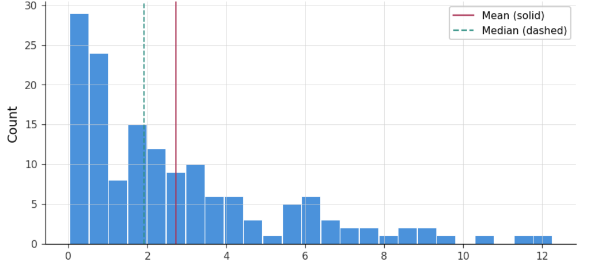
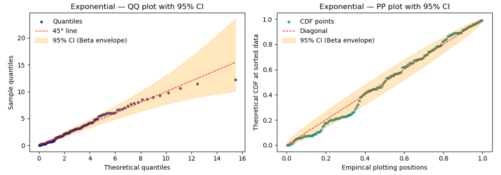
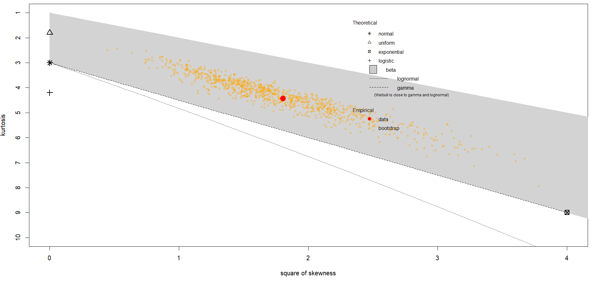
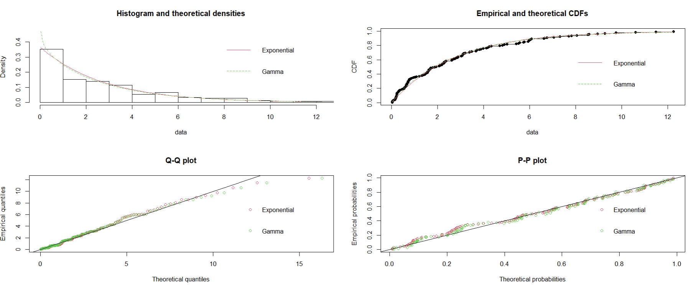
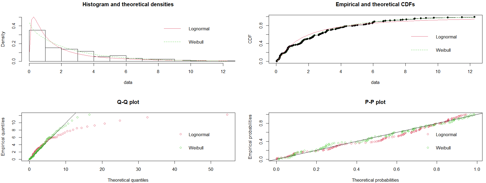
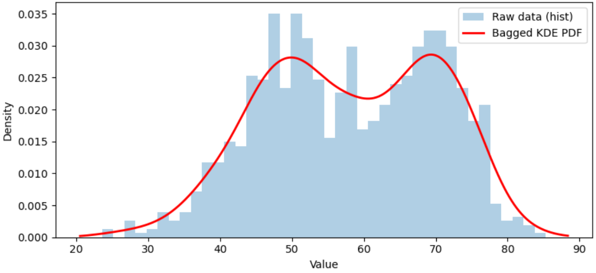
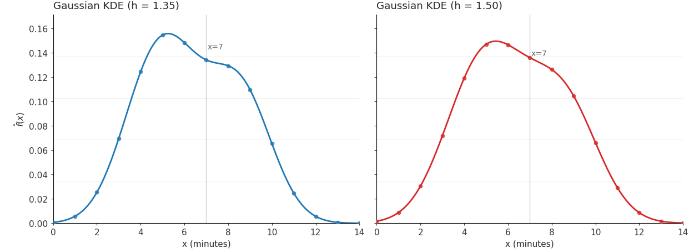

# Estimating probability distributions from data {#ch:EstProbDist}

<div style="float:right; width:100%; text-align:right; font-style: italic; margin: 20px 0;">

> Probability theory is nothing but common sense reduced to calculation.  
> — Pierre Simon Laplace

</div>

In simulation modeling, real-world data are typically fitted to an appropriate probability distribution. This distribution serves as a mathematical representation of the inherent variability of the system and is used as input in the simulation model. Using a probability distribution offers several key advantages:

1.  **Accurate capture of variability.** Real-world processes are stochastic and variable. When fitting a distribution to data, we can model this variability mathematically rather than using a single average or arbitrary values.

2.  **Random Sampling.** A fitted distribution provides a formal mechanism to sample realistic values during Monte Carlo or Discrete Event Simulation runs.

3.  **Improvement of predictive accuracy.** A well-fitted distribution ensures that outputs^[e.g., waiting times, resource utilization,
processing times, etc.] reflect real-world behavior, improving decision-making.

4.  **Sensitivity and Risk Analysis.** Distributions allow the exploration of uncertainty and assessment of risk. For example, tail probabilities can be estimated for extreme events.

5.  **Statistical Validation.** Using distributions enables hypothesis testing, goodness-of-fit checks, and confidence interval estimation, making the model scientifically defensible.

Real-world systems are inherently stochastic: arrivals occur unpredictably, service times vary with task complexity, and resource availability fluctuates due to human, machine, and operational factors. Relying solely on deterministic values suppresses these variations and fails to capture the true behavior of the system. As a result, a model will behave like a rigid, clockwork mechanism rather than a dynamic process influenced by both common and special causes of variation^[Other transient effects, congestion, sudden arrivals, or rare and influential delays cannot appear if the model has been stripped of the variability that generates them.].

## Data adequacy

Before fitting any dataset to a probability distribution it is essential to recognize that the quality and characteristics of these data fundamentally affect the validity of the model. Therefore, distribution fitting is not just a mechanical exercise; it is a process grounded in statistical assumptions and practical considerations. If these assumptions are violated or the data are not adequate for the task, the fitted distribution may misrepresent reality, leading to inaccurate simulations and poor decision making^[Systematically validating data quality, independence, shape, and domain, engineers ensure that the fitted distributions are both statistically sound and
practically meaningful.].

### Data integrity

Ensure that the dataset is complete, accurate, and consistent. Missing values can bias parameter estimates, inconsistent units or scales can distort the shape of the distribution^[For example, if service times are recorded in both seconds and minutes without conversion, the resulting distribution will be meaningless.]. Data integrity is the foundation of reliable input modeling in simulation studies^[And big data analytics.].

### Outlier detection and handling

Outliers and influential values^[Outliers are observations that are far from the bulk of the data, typically judged by distance from the mean or median (e.g., using z-scores or IQR). An influential value is an observation that, if removed, will make the model change in
behavior.] can significantly affect parameter estimation, especially for distributions sensitive to tail behavior, such as the Normal or Gamma distribution. Visualization tools like boxplots or statistical measures such as z-scores help identify this and other anomalies. For instance, if most processing times are between 2 and 20 minutes but one observation is 240 minutes, this extreme value could dramatically skew the fitted distribution. The engineer should carefully evaluate whether to exclude, adjust, or model these observations separately, based on whether they reflect genuine process variability or result from data errors.

### Assessment of independence and stationarity

Most distribution-fitting techniques assume that observations are independent and identically distributed^[iid]. When data exhibit autocorrelation or temporal trends, these assumptions are violated, indicating that the underlying process is nonstationary. Under such conditions, fitting a distribution with constant parameters can produce biased estimates. For instance, failing to account for a learning effect when estimating service times may lead to an overestimation of future system performance.
Diagnostic tools such as autocorrelation functions and runs tests are commonly used to identify these patterns. Ignoring dependence or non‑stationarity can undermine the validity of the model and ultimately lead to incorrect conclusions.

### Exploration of data shape

Before selecting candidate distributions the engineer should examine the empirical shape of the data using histograms, empirical cumulative distribution functions (CDFs), box-plots, etc. These visualizations reveal skewness, modality, and tail behavior^[For example, a histogram showing strong right skew suggests Exponential, Gamma, or Lognormal distributions.].

### Verification of support and constraints.

The domain of data must match the domain of the probability distribution. Data that is only positive, such as service times, cannot be modeled with a Normal distribution without introducing a computational bound on the occurrence of impossible negative values. Similarly, bounded data like probabilities should be modeled with Beta or Uniform distributions. This step ensures logical consistency between the data and the simulation model.

### Ensure adequate sample size

Small samples can lead to unreliable parameter estimates and poor goodness-of-fit results. While there is no universal rule, a minimum of 30 representative observations is often recommended for basic fitting, with larger samples needed for heavy-tailed distributions^[A distribution is considered *heavy tailed* if its tail decays more slowly than an exponential function. For heavy tailed Weibull –with shape parameter <1, lognormal, and light tailed distributions like the Gamma, a minimum sample size of 100 will work reasonably well. For extreme cases, the engineer is referred to @Stuart2001, where the minimum sample can be greater than 500.].

### Estimate summary statistics

Calculating mean, variance, skewness, and kurtosis provides clues about suitable distributions. For example, if skewness is near zero, a Normal distribution may be appropriate; if skewness exceeds one, Gamma or Lognormal might fit better. Comparing these statistics to theoretical values helps narrow down candidates before formal testing.

### Plan goodness of fit estimation

Finally, engineers should prepare to validate the chosen distribution using both graphical and statistical methods. Q--Q and P--P plots offer visual checks, while tests such as Kolmogorov--Smirnov, Anderson--Darling, and Chi-square provide quantitative measures. These evaluations confirm whether the fitted distribution adequately represents the data.

## Parametric fitting: Goodness of Fit estimation

Parametric fitting means estimating the parameters of a chosen probability distribution so that it best represent the observed data. The engineer selects a specific family of distributions^[e.g., Normal, exponential, Weibull, Poisson, etc.] and uses statistical methods to find parameter^[Average, dispersion, location, etc.] values that make the distribution fit the data as closely as possible.

The key steps of a parametric approach to obtain a probability distribution from real sample data are:

1.  Assumption of the *parametric form* of a probability distribution that will fit these data.

2.  Estimation of the parameters of the distribution from the sample data.

3.  Validation of the distribution fit using goodness of fit^[GOF] and visual tests^[Kolmogorov-Smirnov, Anderson-Darling, Chi-Square, histogram overlay, Q-Q and P-P plots.].

### Distributions frequently used in simulation

Stochastic events such as machine breakdowns, job arrivals, processing times, and quality inspections occur at irregular intervals and under uncertain conditions. To model these phenomena accurately, simulation practitioners rely on both discrete and continuous probability distributions, as well as families of distributions that share common properties.

*Discrete distributions* describe random variables used to model counts of outcomes. For example, the Bernoulli distribution models success or failure in a single trial, such as whether a part passes inspection or a budget is approved. The Binomial distribution extends this to multiple trials, making it useful for estimating yield rates in batch production or number of defaults in portfolio investment. The Poisson distribution is widely used to model the number of arrivals or failures within a given time interval, which is critical for queuing systems and reliability analysis, or to model the frequency of operational losses --fraud, system outages, per period.

*Continuous Distributions* are essential for modeling time-related variables such as processing times, interarrival times, and machine lifetimes. The Exponential distribution is commonly used to represent the time between arrivals or failures, making it a cornerstone in reliability and queuing theory. The Normal distribution is often applied to processing times and quality measurements when variability is symmetric and well-behaved. For real-world processes that exhibit skewness, the Lognormal distribution is more appropriate for modeling cycle times. The Gamma distribution is useful for service times with variability, while the Weibull distribution is a standard choice for modeling machine lifetimes and failure probabilities. The Uniform distribution is employed when all values within a range are equally likely, such as randomized setup times or inspection intervals.


@tbl-disttable presents some of the probability distributions used in simulation, their type, and examples of the process they can model, as well as the simulation measurement they can support.

::: {#tbl-disttable}

| Distribution | Type | Process | Measurement example |
|:----------|:------|:----------------|:------------------|
| **Bernoulli** | Discrete | Success/Failure of an operation or inspection | Probability of success |
| **Binomial** | Discrete | Number of successes in a batch | Yield rate |
| **Poisson** | Discrete | Number of arrivals or failures in a time interval | Arrival rate, failure rate |
| **Geometric** | Discrete | Number of trials until first success | Mean trials to success |
| **Negative Binomial** | Discrete | Failures before a set number of successes | Reliability measure |
| **Exponential** | Continuous | Time between arrivals or failures | Mean Time Between Failures (MTBF) |
| **Normal** | Continuous | Processing times, quality measurements | Mean and variance of cycle time |
| **Lognormal** | Continuous | Processing times with skew | Cycle time distribution |
| **Gamma** | Continuous | Service times with variability | Throughput time |
| **Weibull** | Continuous | Machine lifetime or component reliability | Reliability, failure probability |
| **Uniform** | Continuous | Randomized setup times or inspection intervals | Range of possible times |
| **Triangular** | Continuous | Processing times: best, most likely (mode), and worst case | Probability of finishing a project |

Distributions and some examples of their uses.

:::

### Example: Fitting a probability distribution to data {#example .unnumbered}

@tbl-expdata presents 150 values of inter-arrival times for a manufacturing process in minutes. We will model these data using a probability distribution following the three-step approach outlined before.

::: {#tbl-expdata}

|  |  | $x_i$ |  |  |
|----|----|----|----|----|
| 4.82 | 0.16 | 7.32 | 0.18 | 2.87 |
| 0.79 | 5.94 | 4.70 | 8.06 | 2.33 |
| 5.98 | 6.08 | 6.61 | 2.62 | 2.10 |
| 4.25 | 2.68 | 0.32 | 3.72 | 0.23 |
| 0.45 | 2.18 | 0.66 | 0.74 | 4.89 |
| 9.26 | 2.07 | 0.28 | 1.20 | 1.68 |
| 1.78 | 3.09 | 0.94 | 0.14 | 1.01 |
| 0.23 | 5.77 | 2.26 | 0.03 | 0.61 |
| 0.32 | 2.63 | 10.61 | 0.60 | 0.02 |
| 8.95 | 4.11 | 3.03 | 5.98 | 3.06 |
| 2.21 | 1.40 | 3.67 | 0.25 | 0.17 |
| 7.81 | 2.32 | 0.55 | 5.02 | 0.77 |
| 2.88 | 1.65 | 1.94 | 1.48 | 1.61 |
| 6.65 | 2.36 | 4.33 | 2.79 | 3.07 |
| 3.20 | 1.69 | 6.76 | 0.32 | 9.75 |
| 0.23 | 0.03 | 0.22 | 3.10 | 8.54 |
| 0.66 | 1.54 | 5.57 | 6.03 | 0.20 |
| 2.28 | 0.10 | 0.62 | 3.41 | 0.86 |
| 2.63 | 0.19 | 0.05 | 1.61 | 0.24 |
| 1.50 | 0.83 | 0.72 | 0.48 | 0.27 |
| 5.97 | 4.17 | 0.56 | 11.49 | 0.76 |
| 2.87 | 1.34 | 1.56 | 1.87 | 3.13 |
| 0.69 | 1.31 | 1.07 | 3.81 | 0.37 |
| 0.06 | 0.68 | 5.52 | 1.59 | 0.22 |
| 1.61 | 0.18 | 2.28 | 7.05 | 0.73 |
| 0.63 | 2.10 | 5.42 | 0.66 | 3.98 |
| 2.20 | 3.39 | 7.70 | 3.48 | 1.44 |
| 0.54 | 2.74 | 0.71 | 3.89 | 4.20 |
| 5.73 | 1.56 | 12.26 | 3.69 | 8.58 |
| 0.23 | 3.13 | 0.64 | 1.70 | 0.71 |

Continuous inter-arrival data (in minutes).

:::

1.  *Candidate probability distribution.* These are inter-arrival times from a manufacturing process. Using @tbl-disttable as our guide, a good candidate could be the *exponential distribution*^[Other candidates can be the Weibull, and Gamma family of distributions. The young Padawan is encouraged to investigate why.].

2.  *Parameter estimation.* @fig-HistInterData and 
@tbl-expdatastats presents the histogram and statistics of these data. The exponential distribution has the form:
$$
f(x, \lambda, \theta) = \lambda e^{-\lambda (x-\theta)}, \quad x \geq 0
$$

where  $\lambda = \frac{1}{\mu-\theta}$, and $\theta$ is the location parameter^[From our sample data, the statistic
$\hat{\mu}=\hat{\theta}+\frac{1}{\lambda}$  is the mean in @tbl-expdatastats and the location statistic is the minimum
value of the sample: $\hat{\theta}= 0.023.$].

::: {#tbl-expdatastats}

| $\hat{\mu}$ | $\hat{\sigma}$ | min | $Q_1$ | $\tilde{x}$ | $Q_3$ | max |
|----------|---------|--------|-------|--------|-------|-----|
| 2.727 | 2.670 | 0.023 | 0.660 | 1.910 | 3.870 | 12.260 |

Sample statistics of inter-arrival data.

:::


::: {#fig-HistInterData}
{width=90% alt="Histogram that shows the distribution of interarrival data." }

Histogram of interarrival data.
:::


3.  *Goodness of Fit and Visual tests.* Applying the Kolmogorov-Smirnov GOF, the $p$-value is 0.21, failing to reject the null hypothesis^[$H_0$ : Data is exponentially distributed.] at an $\alpha=0.05$^[There is a caveat in the calculation
of *p-values* for distribution fitting: the parameters are estimated from the data, this makes the test statistic of the GOF smaller, on the average, resulting in *p-values* that are inflated or too optimistic rejecting $H_0$ less often than it should. This situation will be covered in the next section when using statistical libraries to generate and compare the performance of different distributions to model data.]. The corresponding visual tests: $Q-Q$, and $P-P$ plots, are presented in @fig-QQPPExpoData.

::: {#fig-QQPPExpoData}
{width=100% alt="QQ and PP plots showing exponential distribution fitting the sample data."}

Q-Q and P-P plots for inter-arrival data.
:::

From the analysis performed, we can model the inter-arrival process using an exponential distribution with $\hat{\lambda} \simeq 0.37$, and $\hat{\theta}=0.023$.

## Statistical libraries to estimate probability distributions from data

The @Rproject2025 package `fitdistrplus` from @Muller2015 provides functions to fit **univariate** distributions for different types of data^[Continuous, censored, non-censored, and discrete.] and allowing different estimation methods (maximum likelihood, moment matching, quantile matching and maximum goodness-of-fit estimation). This package also provides various functions to compare the fit of several distributions to the same data set and can handle bootstrap parameter estimates.

The workflow is the following:

1.  Load the data

2.  Generate and interpret the Cullen & Frey graph to obtain candidate distributions.

3.  Fit candidate distributions to data and obtain estimated parameters.

4.  Obtain GOF test statistics, Q-Q, and P-P plots.

5.  Select the distribution that provides the best visual and statistical fit.

After loading the data from @tbl-expdata The Cullen & Frey graph is presented in @fig-Cullfrey. This graph is a diagnostic tool that helps choose candidate distributions for our data based on *skewness* and *kurtosis*.

::: {#fig-Cullfrey}
{width=100% alt="Cullen and Frey chart that suggets the type of distribution to use based on skewness and kurtosis"}

Cullen and Frey graph for inter-arrival data.
:::


The $x$-axis is squared skewness. The $y$-axis is kurtosis. The sample data is represented by the bigger red dot^[With a region of yellow samples if bootstrapping is used.]. The graph shows theoretical positions and reference points for common distributions:

1.  **Normal**: Skewness =0, kurtosis=3 (near the bottom left).

2.  **Uniform**: Skewness $\simeq$ 0, kurtosis $\simeq$ 1.8.

3.  **Exponential**: Skewness $\simeq$ 2, kurtosis $\simeq$ 9.

4.  **Lognormal**: Higher skewness and kurtosis (upper right).

5.  **Gamma**: Between normal and exponential.

6.  **Weibull**: Close to Gamma and Lognormal.

7.  **Beta**: Within gray region, if data are proportions, probabilities or rates defined on the interval $[0,1]$^[If data are unbounded (e.g., positive real numbers), Beta is not considered because its support does not match the data.].

The interpretation is:

- If the red point is near **Normal**, consider fitting a normal distribution.

- If the point is far to the right, high skewness, consider **Lognormal** or **Gamma**.

- If the red point is very high on kurtosis, heavy-tailed distributions like **Lognormal** or **Weibull** might fit better.

- The bootstrapped confidence region (yellow dots) shows variability in skewness and kurtosis estimates. If this ellipse of yellow dots overlaps multiple distribution zones, the engineer may need to compare different candidates.

For our data, we considered four candidates to fit^[The young Padawan might have selected different ones.]: Exponential, Gamma, Weibull, and Lognormal. @tbl-paramfit presents the results of each fit.

::: {#tbl-paramfit style="width:100%; overflow-x:auto;"}

| Distribution | Rate | Shape | Scale | Mean log | SD Log | Loglikelihood | AIC | BIC |
|:--------------|:------:|:------:|:------:|:---------:|:--------:|:---------------:|:-----:|:-----:|
| Exponential | 0.366615 | NA | NA | NA | NA | -300.5165 | 603.0330 | 606.0437 |
| Gamma | 0.336937 | 0.91915 | NA | NA | NA | -300.1593 | 604.3186 | 610.3398 |
| Weibull | NA | 0.95586 | 2.6750 | NA | NA | -300.2728 | 604.5457 | 610.5669 |
| Lognormal | NA | NA | NA | 1.0000 | ~ 0 | -311.8372 | 627.6744 | 633.6957 |

Parameters and fit measures per distribution.

:::

The last three columns of @tbl-paramfit present goodness of fit statistics designed to penalize complexity:

- **Log-likelihood (loglik)**: Measures how well the model explains the data: **higher** is better^[loglik is a measure of fit.].

- **Akaike Information Criterion (AIC)**: $AIC=2k-2\cdot \textnormal{loglik}$, where $k$ is the number of parameters. A **lower** AIC indicates a better trade-off between fit and parsimony^[Parsimony in the context of statistical modeling refers to the principle of simplicity: a model should explain the data well while using the fewest possible parameters or complexity.].

- **Bayesian Information Criterion (BIC)**: $BIC=log(n) \cdot k -2 \cdot\textnormal{loglik}$, where $n$ is the sample size. **Lower** BIC prefers simpler models more strongly than AIC because it has a heavier penalty on $k$.


::: {.callout-note style="text-align: justify;"}
Goodness‑of‑fit measures such as the log‑likelihood, AIC, and BIC help us evaluate how well a probability distribution matches observed data. In simple terms, the log‑likelihood tells us how likely it is that the data were generated by a given model—the higher it is, the better the fit. However, models with more parameters tend to fit data better just by being more flexible, so criteria like AIC (Akaike Information Criterion) and BIC (Bayesian Information Criterion) adjust for this by penalizing model complexity. Thus, they reward models that achieve a good fit using fewer parameters. In practice, lower AIC or BIC values indicate a better balance between accuracy and simplicity, guiding us toward models that *generalize* well rather than just fitting the data closely.
:::


The key is to compare AIC and BIC across all the fitted distributions and select the one with the smallest values. The absolute difference in the AIC or BIC values between two competing models is a good measurement. For example, if model A has AIC of 200, and model B has AIC of 202, the absolute difference is $|200-202|=2$. if the absolute difference is less than 2, the models are essentially equivalent. If it is between 2 and 4, there is evidence favoring the lower AIC. If it is between 4 and 7, there is strong evidence favoring the model with lowest AIC. Of course, the criteria also applies for BIC.

From the values in @tbl-paramfit, the absolute differences in AIC among the Exponential, Weibull, and Gamma distributions are less than 2. The BIC differences between the Exponential, Gamma and Weibull distributions are 4, favoring the lower BIC of the Exponential. The lognormal distribution has larger AIC and BIC by more than an absolute difference of 20 and we can eliminate it from the analysis. A solid candidate is emerging.

The next step is to evaluate the goodness-of-fit test statistics presented in @tbl-fitteststats. They measure the distance between the empirical and fitted CDF.

::: {#tbl-fitteststats}

| Statistic | Exponential | Gamma | Lognormal | Weibull |
|:-----------|------------:|------:|----------:|--------:|
| Kolmogorov–Smirnov  | 0.08105931 | 0.06239441 | 0.1059878 | 0.06478679 |
| Cramér–von Mises  | 0.12147605 | 0.07654783 | 0.3670428 | 0.08499319 |
| Anderson–Darling  | 0.82000833 | 0.491181 | 2.1970168 | 0.54486401 |

Goodness-of-fit test statistics.

:::

The description of each one of these test statistics is:

- **Kolmogorov-Smirnov (KS)**: The test statistic is $D=\textnormal{sup}_x|\hat{F}(x)-F(x, \tau)|$ which is the maximum vertical gap between the empirical $(\hat{F}(x))$ and fitted $(F(x, \tau))$ CDF. **Smaller is better**^[*p-values* from classical GOF tests assume *fixed* parameters; when these parameters are estimated from the same data (as is typical in distribution fitting), those *p-values* can be optimistic. Use the test statistic as a rough guide and rely on visual diagnostics.].

- **Cramer-von Mises (CvM)**: The test statistic is the integrated squared distance $\int[\hat{F}(x)-F(x, \tau)]^2 \, dF(x)$. **Smaller is better.** This statistic is sensitive to differences across the entire distribution.

- **Anderson-Darling (AD)** The test statistics is a tail-weighted squared distance $\int \frac{[\hat{F}-F]^2}{F(1-F)} dF$. **Smaller is better**. This statistic places more emphasis on the **tails**. Therefore, it is useful when tail fit matters.

To use these test statistics we compare KS, CvM, and AD across models and select the one with **consistently smaller values**. At the same time, verifying the Q-Q and P-P plots to confirm the selection.

According to the test statistics the Gamma distribution is the best candidate^[Followed by the Weibull and Exponential distributions respectively.], but not by much. @Fig-ExpGam and @Fig-LogWeib present a visual confirmation that includes P-P and Q-Q plots.

::: {#fig-ExpGam}
{width=100% alt="Overlap of pdf, CDF theoretical -Gamma and Exponential-- vs data distributions"}

Visual fits for Exponential and Gamma distributions
:::

::: {#fig-LogWeib}
{width=100% alt="Overlap of pdf, CDF theoretical -Lognormal and Weibull-- vs data distributions"}

Visual fits for Lognormal and Weibull distributions
:::


To conclude our exercise, we might decide to proceed fitting the Exponential distribution to our data^[It has a good fit and needs less
parameters.]. @lst-rscript provides the *R* script for this example.


::: {#lst-rscript}

::: {.callout-note title="Listing: R script for fitting a probability distribution to data."}

```r
#| label: lst-rscript
#| caption: R script for fitting a probability distribution to data.

# Read data file
library(readxl)
Inter_Times_Fit <- read_excel("Inter_Times_Fit.xlsx")
View(Inter_Times_Fit)

# Create data frame
data <- Inter_Times_Fit$Inter_T
head(data, 10)

library(fitdistrplus)

# Generate Cullen and Frey chart with bootstrap
descdist(data, boot = 1000)

# Fit distributions
fit_exp    <- fitdist(data, "exp")
fit_gamma  <- fitdist(data, "gamma")
fit_lnorm  <- fitdist(data, "lnorm")
fit_weib   <- fitdist(data, "weibull")

summary(fit_exp)
summary(fit_gamma)
summary(fit_lnorm)
summary(fit_weib)

# Goodness-of-fit tests
gof <- gofstat(list(fit_exp, fit_gamma, fit_lnorm, fit_weib))
gof

# Plots
par(mfrow = c(2,2))

denscomp(list(fit_exp, fit_gamma),
         legendtext = c("Exponential", "Gamma"))

cdfcomp(list(fit_exp, fit_gamma),
        legendtext = c("Exponential", "Gamma"))

qqcomp(list(fit_exp, fit_gamma),
       legendtext = c("Exponential", "Gamma"))

ppcomp(list(fit_exp, fit_gamma),
       legendtext = c("Exponential", "Gamma"))

par(mfrow = c(2,2))

denscomp(list(fit_lnorm, fit_weib),
         legendtext = c("Lognormal", "Weibull"))

cdfcomp(list(fit_lnorm, fit_weib),
        legendtext = c("Lognormal", "Weibull"))

qqcomp(list(fit_lnorm, fit_weib),
       legendtext = c("Lognormal", "Weibull"))

ppcomp(list(fit_lnorm, fit_weib),
       legendtext = c("Lognormal", "Weibull"))
```
:::
::: 

## Kernel Density Estimation: non-parametric fitting

The concept was introduced by @Rosenblatt1956, and @Parzen1962. Kernel Density Estimation (KDE) is a non-parametric method to estimate the PDF of a random variable based on observed data. Unlike parametric methods that assume a specific distribution, KDE makes no such assumption and instead smooths the data using a kernel function, see @fig-KDEill.

::: {#fig-KDEill}
{width=80% alt="Kernel density graph of a bimodal distribution."}

Kernel density example for a bimodal distribution.
:::


A kernel function is simply a smooth, bell shaped curve used in KDE to \"spread out\" each data point and create a continuous estimate of the underlying distribution.

The procedure is as follows:

1.  Collect a representative sample ($n$) of data: $x_1, x_2, x_3, \ldots, x_n$.

2.  Place a kernel function^[Usually Gaussian but can be uniform
or Epaneshnikov.].

3.  Sum these kernels to create a smooth estimate of the PDF: 
$$
    \hat{f}(x)=\frac{1}{n \cdot h} \sum_{i=1}^{n}K \left(\frac{x-x_i}{h}\right)
$$ {#eq-kde}

where:

- $K(\cdot)$ is the kernel function.

- $h$ is the bandwidth that controls smoothness^[Smaller *h* for more detail, and larger *h* for a smoother curve.].

- $x$ represents the location where the engineer want to estimate the probability density^[For example, if we have data on service times and want to know the estimated probability density at 10 minutes, then *x = 10*. Note that *x* is not necessarily one of the data points, it is a *query point*.].

The Gaussian kernel $K(u)$ is:

$$
    K(u)=\frac{1}{\sqrt{2 \cdot \pi}} e^\frac{-u^2}{2}
$$

The Gaussian kernel is a smooth, bell-shaped function used in Kernel Density Estimation (KDE) to evaluate a probability density without assuming a specific distribution. It works by placing a Gaussian curve at each data point and summing these curves to create a continuous estimate, with the bandwidth controlling the width of each curve. This kernel is ideal when you need a smooth estimate for continuous data [@Wand1995], especially when the underlying distribution is unknown or multimodal, and when tails matter because it has infinite support. It is widely used due to its mathematical convenience and compatibility with automatic bandwidth selection methods, though it may not be suitable for bounded data without adjustments. In summary, use a Gaussian kernel when:

- A smooth and continuous estimate is desired. This is ideal for data without sharp boundaries.

- The underlying distribution is unknown or multimodal. This is, it works well for data with multiple peaks.

- Mathematical convenience is a priority. These kernels are differentiable and easy to integrate.

- They work well with automatic bandwidth selection methods like @Scott1992, and @Silverman1998.

- Tails matter. Gaussian kernels have infinite support, they handle tails better than bounded kernels like @Epanechnikov1969.

Scott's rule has the formula:

$$
    h=\sigma \cdot n^{-\frac{1}{5}}
$$

Where:

- $\sigma=$ sample standard deviation

- $n=$ sample size

Silverman's rule of thumb has the formula^[$IQR \approx 1.349 \times \sigma$ for a normal distribution. Therefore, the formula picks the smaller of the two robust scale estimates: $\sigma$ or normalized *IQR*. Remember that *IQR* is less sensitive to outliers than $\sigma$.]:

$$
    h=0.9 \cdot \textnormal{min} \left( \sigma, \; \frac{IQR}{1.34}\right) \cdot n^{-\frac{1}{5}}
$$

### Example: Generation of a distribution using KDE {#Example .unnumbered}

The following are service times, in minutes: $[4, 5, 6, 8, 9]$. We will estimate a non-parametric PDF for these data.

1.  Choose a Kernel. In this case, the Gaussian kernel.

2.  Select the bandwidth $h=1.5$.

3.  Compute KDE at point $x=7$. Applying @eq-kde: $\hat{f}(7)\simeq 0.13612$. Therefore, the estimated density is $\hat{f}(7)=0.136$.

4.  Repeat for other query points $x$, from 0 to 14, and plot the KDE.

@tbl-fxcomparison shows the results of the pairs $(x, \hat{f}(x))$ for different values of $h$ corresponding to Scott's formula ($h=1.5$) and Silverman's ($h=1.35$).

::: {#tbl-fxcomparison}

| $x_i$ | $h=1.35$ $\hat{f}(x)$ | $h=1.5$ $\hat{f}(x)$ |
|:------:|:-----------------:|:----------------:|
|0 |               0.001   |          0.002 |
|1 |               0.006   |          0.009 |
|2 |               0.025   |          0.031 |
| 3  | 0.070 | 0.072 |
| 4  | 0.125 | 0.119 |
| 5  | 0.155 | 0.147 |
| 6  | 0.148 | 0.147 |
| 7  | 0.134 | 0.136 |
| 8  | 0.129 | 0.126 |
| 9  | 0.110 | 0.105 |
| 10 | 0.065 | 0.066 |
|11             | 0.025          |   0.029|
|12              | 0.006             | 0.009|
|13              | 0.001             | 0.002|
|14              | 0.000             | 0.000|
Comparison of $\hat{f}(x)$ values for $h=1.5$ and $h=1.35$.

:::

The corresponding density functions are shown in @fig-KDEfigures.


::: {#fig-KDEfigures}
{width=100% alt="Kernel density graphs for the example."}

KDE’s for example data at two values of h.
:::


## Conclusion

Fitting probability distributions from data is essential for representing variability in simulation models. This process requires not only statistical techniques but also careful evaluation of data quality and *modeling assumptions*. A sound approach combines graphical analysis, goodness‑of‑fit measures, and *engineering judgment* to select models that are actionable and elegant.

Effective input modeling is one of the elements that makes simulation models meaningful and reliable.


## Questions

1.  Why is fitting probability distributions to data important in simulation?

2.  What is meant by "accurate capture of variability"?

3.  How does distribution fitting improve predictive accuracy?

4.  What role do probability distributions play in sensitivity and risk analysis?

5.  Why is data adequacy critical before fitting a distribution?

6.  What are the consequences of poor data integrity?

7.  Define outliers and explain their impact on distribution fitting.

8.  What does it mean for data to be independent and identically distributed (iid)?

9.  What is stationarity and why is it important?

10. How can histograms and empirical CDFs help in selecting distributions?

11. Why must the support of the data match the distribution?

12. What sample size is generally considered acceptable for distribution fitting?

13. What summary statistics are useful for selecting candidate distributions?

14. What is the purpose of goodness-of-fit (GOF) tests?

15. Define parametric fitting.

16. What are the key steps in parametric distribution fitting?

17. Give examples of discrete distributions used in simulation.

18. Give examples of continuous distributions used in simulation.

19. What do AIC and BIC measure?

20. What is kernel density estimation (KDE)?

## Exercises

1.  **Data Interpretation.** Given $\hat{\mu} = 2.727$ and $\hat{\theta}=0.023$, compute $\hat{\lambda}$ for an exponential distribution.

2.  **Outlier Effect.** If one observation is 100 while all others are below 10, explain its effect on mean and variance.

3.  **Skewness Analysis.** If a dataset has large positive skewness, suggest appropriate distributions.

4.  **Support Matching.** Can a Normal distribution model service times? Explain.

5.  **AIC Comparison.** Model A has AIC = 500, Model B has AIC = 503. Which is better?

6.  **GOF Interpretation.** If KS statistic is smaller for Gamma than Exponential, which fits better?

7.  **Probability Calculation.** For a Poisson process with $\lambda=3$, compute $P(X=0)$.

8.  **Bandwidth Calculation.** Given $\sigma=2$, $n=100$, compute bandwidth using Scott's rule.

9.  **KDE Understanding.** Explain the effect of a very small bandwidth.

10. **Gamma Fit Insight.** Why might a Gamma distribution be preferred over Exponential?

## Notes of the Chapter {#notes-of-the-chapter .unnumbered}

- Pierre-Simon Laplace (1749--1827) was a French mathematician, physicist, and astronomer with profound contributions to science. Laplace developed the Bayesian interpretation of probability, formulated the Laplace transform, and made major advances in celestial mechanics, explaining the stability of the solar system and predicting the existence of black holes. Funny fact: Laplace was so politically adaptable that he served under the monarchy, the French Revolution, Napoleon, and the restored monarchy, earning him the nickname *the chameleon of science*.

## References {#references .unnumbered}
