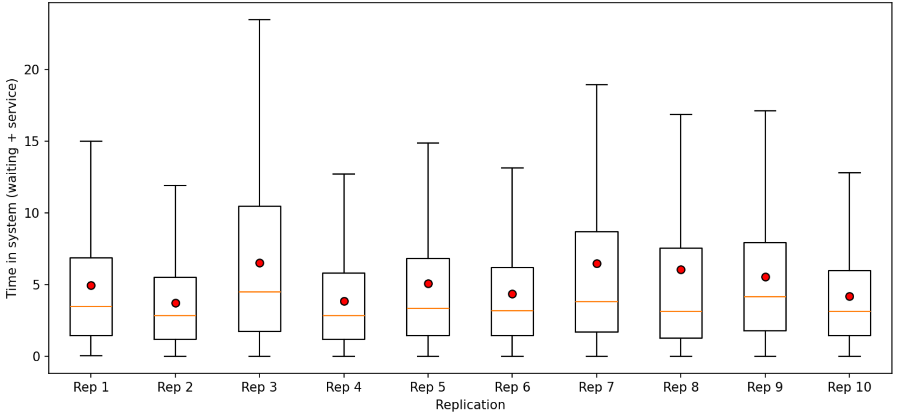
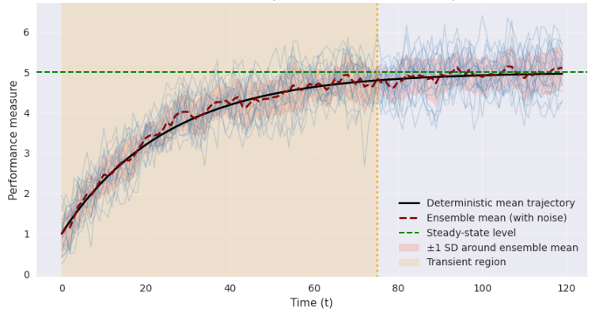
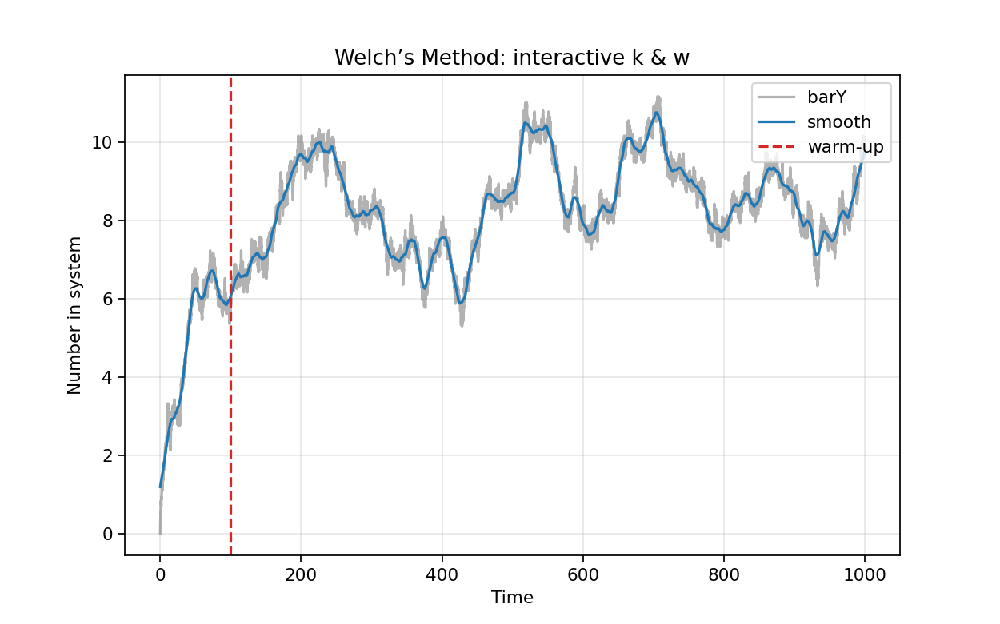
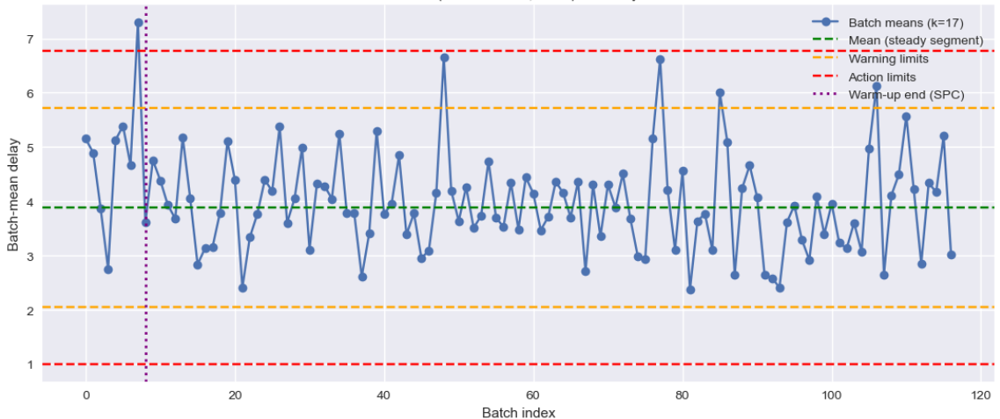

# Output data analysis {#ch:OutputAnalysis}

> I never guess. It is a shocking habit — destructive to the logical faculty.  
> — Sherlock Holmes, *The Sign of Four*

## Introduction

Output analysis is the statistical evaluation and interpretation of results generated by simulation models. Its purpose is drawing valid inferences about the underlying system's performance, quantify uncertainty, and support decision-making [@Kelton1994].

Output analysis is important because simulation results are not always the same: they're affected by randomness, just like the rolling of a fair dice. If the engineer does not analyze the output properly, she will make wrong recommendations and decisions.

Consider a bank teller simulation. If the engineer runs it once and observes that the average wait is only 2 minutes, she might think the teller is efficient. However, running it again she might get 5, or even 10 minutes. Output analysis helps us combine results from many runs, so the engineer will be able to get a trustworthy answer like "most customers wait between 4 and 6 minutes." This helps for better decision making^[Like deciding if the system needs more staff or larger waiting areas.].

Output analysis also includes the design of simulation experiments, the comparison of alternative system configurations, and the use of techniques to improve precision and provide detailed explanations of simulation results^[e.g., design of experiments and
variance reduction techniques.].

Because simulation output is inherently random, analyzing it correctly is essential for drawing meaningful conclusions about system performance. The way we approach output analysis depends fundamentally on the nature of the simulation study: whether we are interested in performance over a finite, scenario-driven period, or in the long-run equilibrium behavior of the system. This distinction leads us to two types of output analysis:

- Terminating or transient.

- Steady-state ot non-terminating.

Understanding these types of output analyses is the foundation for selecting appropriate statistical methods and ensuring the reliability of decisions and recommendations based on simulations [@Goldsman1992], [@Law1983].

## Terminating simulations

A terminating simulation is one where the run length is naturally defined by a scenario event or a fixed time horizon. The simulation starts at a specified initial state and ends when a particular condition is met. Some examples are:

- Simulating a hot dog stand from opening to closing hours.

- Simulating the manufacturing of a finite number of finished goods in a production line.

- Simulating a military engagement until one side is defeated.

- Simulating a manufacturing cell until a given machine fails.

The analysis of such systems considers three aspects:

1.  Run multiple independent replications^[A replication is one complete run of
a simulation model carried out under a fixed set of experimental conditions.], each starting from the same initial conditions.

2.  All statistics^[Averages, dispersion, counts, etc.], at replication level, are treated as IID^[Independent and identically distributed.].

3.  Classical statistical methods are used^[Considering the effects of autocorrelation.].

To better analyze a terminating analysis, think about the simulation of a system until $m$ output values $y_1, y_2, \ldots, y_m$ are collected. Let us assume that we would like to obtain a good estimation of the mean $\hat{\mu}=E(\bar{y}_m)$ of these data^[In this case $\bar{y}_m =\frac{1}{m} \sum_{i=1}^{m} y_i$ is the *sample mean*].

The issue is: in simulation the $y_i$'s are *dependent* random variables, making the estimation of the variance $V(\bar{y}_m)$ a non-trivial problem [@wikipedia_autocovariance]. For example, in many queuing systems the $y_i$'s are positively auto-correlated, making the calculation of the sample variance $\frac{s^2(m)}{m}=\sum_{i=1}^{m} \frac{(y_i - \bar{y}_m)^2}{[m(m-1)]}$ a *highly biased* estimator of $V(\bar{y}_m)$.

How do we solve this problem?^[For simplicity we are using the mean as our performance output, but this approach can be applied to other measures.]

*Solution:* Running $n$ independent replications.

Let replication $r$ produce outputs $y_{r,1}, y_{r,2}, \ldots,y_{r,m}$. Then, the means of each replication:

$$\bar{y}_r =\frac{1}{m}\sum_{i=1}^{m}y_{r,i}$$

Are IID random variables, and the mean of the means:

$$\bar{\bar{y}}_n=\frac{1}{n} \sum_{r=1}^{n} \bar{y}_r$$

is an *unbiased* estimator of $\mu$. Not only that, the estimated variance of the replications:

$$\hat{V}_{rep}=\frac{1}{n-1} \sum_{r=1}^{n} (\bar{y}_r -\bar{\bar{y}}_n)^2$$

is an *unbiased* estimator of $V(\bar{y}_m)$.

If $m$ is large enough^[A number *m* such that the $\hat{y}'s$ *transient* means are approximately **normal**, or the confidence interval (CI) is stable. Pick a sufficiently large value considering if high accuracy is required and the cost/time of running a large
replication is not prohibitive.]:

$$\begin{equation}
    \mu \in \bar{\bar{y}}_n \pm t_{(n-1, 1-\frac{\alpha}{2})} \cdot \sqrt{\frac{\hat{V}_{rep}}{n}}
\end{equation}$$

is a good approximation of a $100(1-\alpha)$ two sided confidence interval around the mean $\hat{y}_n$. Where $t_{(n-1,1-\frac{\alpha}{2})}$ is the $1-\frac{\alpha}{2}$ quantile of the $t$ distribution with $n-1$ degrees of freedom^[Low-key the moment the senior IME student realizes stats, math, and all those random classes were actually clutch.].

### Estimating the number of replications $n$

In terminating simulations each replication yields one independent observation of our performance measure^[e.g., average cost in a day, % rejected
in a shift, etc.]. We then form a t‑based confidence interval (CI) across replications; the usual target being the achievement of a desired absolute half‑width $h$ or relative precision.

One elegant procedure to estimate $n$, is called *pilot runs* [@Centeno1998]:

1.  Perform a short pilot of $n_0$ replications, usually $n_0 \in [5,10]$, and calculate the cross replication standard deviation $s=\sqrt{\hat{V}_{rep}}$.

2.  If $h_0=t_{(n_0-1, 1-\frac{\alpha}{2})} \cdot \sqrt{\frac{s}{n_0}}$ is less than the desired $h$, then there is no need for further replications. However, if $h_0 > h$, then $n$ can be estimated using: $$n=\left \lceil n_0 \cdot \left(\frac{h_0}{h}\right)^2 \right\rceil$$

### Example of terminating simulation and calculation of $n$

We are to calculate the mean time in the system for entities going through an MM1 queue with $\lambda=0.8$, and $\mu=1$. The client requests a CI at 95% with a half width precision of 3% of the sample mean. The first $n_0=10$ replications of $m=1000$ entities are presented in @tbl-terminatingN0.

::: {#tbl-terminatingN0}
   **r**   $\bar{y}_r$
  ------- -------------
     1     4.95156984
     2     3.702752994
     3     6.501464905
     4     3.863453618
     5     5.089188779
     6     4.371318475
     7     6.460842523
     8     6.054292074
     9     5.552893988
    10     4.195403425

  : $n_0=10$ initial replications with mean time in system (Waiting + Service)
:::

@fig-RepsTerm presents box-plots of each replication.

::: {#fig-RepsTerm}
{width=80% alt="Box-plots of each replication." }

MM1 system, first $n_0 = 10$ replications. Red dots represent the mean value, orange lines the median.
:::

The statistics for our pilot of 10 replicates are: $\hat{\hat{y}}_{10}=5.047$, with a 95% CI=\[4.3287, 5.8200\], and $h_0 \simeq 0.7456$. The target precision is $h \simeq 0.152$. Then, $n \simeq 241$.

Are the replicate means normally distributed?

## Steady state simulations

A steady-state or non-terminating simulation studies the *long-run* behavior of a system, *aiming to estimate parameters that are independent of initial conditions*. The system is assumed to reach an equilibrium distribution after a sufficient *warm-up* or transient period.

Some examples are:

- Simulating a continuously running production line to estimate long-run average throughput.

- Simulating a call center to determine the mean number of calls in queue over an indefinite period.

- Simulating a manufacturing system operating 24/7 to estimate average daily output.

The main issue to overcome with steady state simulations is the removal of *initialization bias*. This can be explained mathematically by considering the values $y_1,y_2,  \ldots, y_m$ the result of a simulation run with a set of initial conditions $I$^[Initial conditions are the state of the system at simulation time t = 0. They define values of state variables, status of resources, and context before any simulated events occur. Good initial conditions reduce initialization bias and ensure the outputs reflect scenarios intended for study.]. If we let $m \to \infty$, we can obtain the long term mean:

$$\mu=\lim_{m \to \infty} E(y_m|I)$$ For finite values of $m$ we can calculate:

$$\bar{y}_m=\frac{1}{m} \sum_{i=1}^{m} y_i$$

to estimate $E(y_m|I)$. Unfortunately, $E(y_m|I) \neq \mu$. @fig-Transient shows that the values of $y_i$'s during the transient period will bias the calculation of the long term mean.

::: {#fig-Transient}
{width=80% alt="Curve of initialization bias." }

Initialization bias for steady state simulations during transient period.
:::

The problem can be practically solved if we estimate an index $l \in [1, m-1]$ used to truncate observations $y_1, \ldots, y_l$, and estimate:

$$\bar{y}_{m,l}=\frac{1}{m-l} \sum_{i=l+1}^{m} y_i$$

The result is that $\bar{y}_{m,l}$ is *generally* less biased than $\bar{y}_m$ because, in practice, initial conditions primarily affect data at the beginning of a run.

The method works well if $m$ is sufficiently large and is characterized by its simplicity and generality.

### Replication-deletion approach with Welch's method

In steady‑state (non‑terminating) simulations, the system is usually initialized in an atypical state^[e.g., empty and idle.] so early observations are not representative of long‑run behavior. Welch's method [@Heidelberg1983] is a simple, *graphical* procedure to identify how many initial observations to delete (the warm‑up period) before estimating steady‑state performance measurements. It does this by smoothing time‑indexed outputs across multiple independent replications and visually locating the point where the smoothed curve stabilizes.

Assume you run $k$ independent replications, each producing a time series performance measure $y$ over $n$ equally spaced indices $i=1, \ldots, n$^[These are time steps or event counts.]:

1.  Replication $r$ produces $y_{r,1}, y_{r,2},\ldots, y_{r,n}$ for $r=1, \ldots, k$.

2.  Independence is enforced by different random-number streams and resetting counters after each replication.

Welch's method reduces path-to-path noise by *averaging the same time index across replications*:

$$\begin{equation}
    \bar{y}=\frac{1}{k} \sum_{r=1}^{k} y_{r,i} \:\:\: i=1,2,\ldots,n.
\end{equation}$$

This produces a *single trajectory* $\bar{y}_1, \bar{y}_2, \ldots, \bar{y}_n$ that is smoother than any of the single replications^[̄$\bar{y}_i$ estimates the transient mean
at index *i*, with reduced variance by aggregation across independent runs.].

Welch then applies a *centered moving average* with window half-width $w$^[The full window is $2w + 1$.], and a smoothed series $\tilde{y}_j$ is obtained:

$$\begin{equation}
    \tilde{y}_j=\frac{1}{2w+1} \sum_{i=j-w}^{j+w} \bar{y}_i \:\:\:\: j=w+1, \ldots, n-w.
\end{equation}$$

At the ends^[$j \leq w$ or $j\geq n-w$], it uses shorter windows considering only the available points^[To avoid bias.]:

$$\begin{equation}
    \tilde{y}_j = \frac{1}{m_j} \sum_{i=max(1,j-w)}^{min(n, j+w)} \bar{y}_i, \:\: \textnormal{where: } m_j=min(n, j+w)-max(1, j-w) +1.
\end{equation}$$

Welch's method recommends the use of a **graphic** to visually reveal when the mean settles. The exact window size is chosen pragmatically to balance noise reduction and responsiveness.

The smoother curve $\tilde{y}_j$ suppresses short term fluctuations . Therefore the engineer can see the underlying drift from the initial transient towards steady state.

To select the truncation point $l$, plot $\tilde{y}_j$ vs $j$ such that the curve appears stable^[Flat and without evident trend.] thereafter. Practically:

- Start at $j=w+1$ and scan forward until the moving average no longer exhibits systematic upward or downward drift.

- Set the warm up period to $l$^[Discard indices $1, . . . , l$ from each replication.]. Then, estimate all performance measurements and confidence intervals on the steady state portion $l+1, \ldots, n$.

@fig-WelchFig shows the application of Welch's method for $k=31$ and $w=125$ in the simulation of the number of entities in system for a MM1 queuing model.

::: {#fig-WelchFig}
{width=80% alt="Transient curve with cutting point using Welch's method" }

Welchs' method for MM1 queeue with $\lambda=0.9$ and $\mu=1.0$.
:::

Welch's method is a graphical procedure designed for general applicability. The original paper and later tutorials make a point of not prescribing a single formula for $w$ because the *right* smoothing depends on^[However, @Mahajan2004 recomends $w \leq \frac{m}{4}$]:

- The volatility of the output.

- How quickly the model drifts toward equilibrium.

- How much averaging at replication‑level is already present.

The recommended practice is to experiment with window widths and choose the smallest $w$ that yields a clearly stable smoothed curve [@Lavenberg1981]. Nevertheless, there are some guidelines to adjust $w$, $k$, and $n$ together:

- An increase in $k$ makes the cross replication average smoother. Then, $w$ can be reduced [@Goldsman2000].

- Increasing $w$ generates more smoothing and an easier stabilization. However, there is the risk of *masking* a genuine drift if $w$ is too large. Then, test different values of $w$ [@Lavenberg1981].

- A larger $n$ provides a longer horizon, which makes the steady state portion more visible. This will help verifying that the selection of $l$ is not just a short-run artifact [@Goldsman2000].

- When there is a strong auto-correlation pick a larger $w$ and/or a longer $n$ [@Mahajan2004].

- The final warm-up truncation $l$ should be robust to modest changes in $w$ and $k$^[Also to time increments in the
simulation clock.] [@Goldsman2000].

### Batch means method

The method of batch means is frequently used to estimate the steady-state mean $\mu$ or $V(\bar{y}_m)$ [@Conway1963], [@Fishman1978], [@Alexopoulos1993], [@Law1979], and [@Schmeiser1982].

The procedure divides the output $y_1, y_2, \ldots, y_m$ of a long simulation run into a number of contiguous batches and uses their sample means^[i.e., Batch means.] to generate estimators with confidence intervals.

A fundamental assumption is that the time series output $\{y_i\}$ is covariance stationary^[A covariance stationary, also called weakly stationary, time series is one whose average level does not drift, its typical variability does not change, and the relationship between values depends only on how far apart they are, not on their calendar date.] with $Cov(y_i, y{i+j})=C_j$ and split the data into $n$ batches, each with $k$ observations^[Assume $m=n \times k$]. The $i$th batch consists of the values: $$y_{(i-1)k+1}, y_{(i-1)k+2}, \ldots, y_{ik}$$ for $i=1,2, \ldots, n$ and the $i$th batch mean is given by:

$$\bar{y}(k)=\frac{1}{k} \sum_{j=1}^{k} y_{(i-1)k+j}$$ Since the process is covariance stationary, it has been shown that:

$$C_l(k)=Cov[\bar{y}_i(k), \bar{y}_{i+1}(k)]=\frac{1}{k} \sum_{j=1-k}^{k-1} \left( 1-\frac{|j|}{k} \right) C_{lk+j}$$ independently of $i$. Therefore, if the auto-covariate function $\{C_j\}$ is such that $C_l(k) \to 0$ as $k$ increases, a batch size $k$ can be identified for which the batch sizes are normally IID. Thus, the grand batch mean is:

$$\bar{y}_n=\bar{y}_m=\frac{1}{n}\sum_{i=1}^{n} \bar{y}_i (k)$$ and the estimate of $Var[\bar{y}_i(k)]$ is:

$$\hat{V}_B=\frac{1}{n-1} \sum_{i=1}^{n} (\bar{y}_i(k)-\bar{y}_n)^2$$ Then, we can compute a $100(1- \alpha)$ confidence interval (CI) for $\mu$:

$$\mu \in \bar{y}_n \pm t_{(n-1, 1-\frac{\alpha}{2})} \cdot \sqrt{\frac{\hat{V}_B}{n}}$$

The main problem with the application of the batch means method in practice is the choice of the batch size $k$. Nevertheless, there are some practical recommendations for its selection:

- Aim for 20 to 30 batches: With too few, the CI can be unstable; with too many, batch size gets too small and batch means remain correlated. [@Schmeiser1982] provides an empirical insight: \"beyond $k \simeq 30$ *the gain is minimal*". This is the classic guidance.

- Increase batch size until correlation is small: Practically, pick $m$ so the $lag‑1$ auto-correlation of the batch means is near zero^[In practice: $\rho_1 \leq 0.1$]. Always verify the auto-correlation of the batch means, and their normality.

- Warm‑up matters: Batch means presumes you already deleted the transient; if you don't, the early bias contaminates the whole series and your CI centers at the wrong mean.

Lastly, the method is preferred when:

- We have one long steady‑state run, rather than many independent replications.

- Warm up can be discarded and stationary behavior afterward is achieved.

- There is need for a simple and auditable CI method embedded in the simulation software.

Batch means ticks all three items above, which is why it used to be in nearly every textbook and commercial package tutorial^[Arena and its output analyzer use batch means. Simio, AnyLogic, FlexSim, SIMUL8, to mention a few, use replication deletion and batch means can be implemented exporting time stamped data, then running the method in Python, R, or Matlab.].

### SPC method

Developed by Stewart Robinson [@Robinson2007], [@Robinson2002]. The method considers the early part of a single long run as a potential initial transient^[Warm up.] and then uses a control chart to detect when the process output has become in‑control or *stable*. Because raw simulation outputs are serially correlated and possibly non‑normal, the SPC chart is built from *non‑overlapping averages of consecutive observations* rather than point‑wise data. The estimates of center line and control limits use the later portion of the run, which is *assumed nearly steady*. The method then scans forward from the beginning to find the earliest time index at which the chart shows in‑control behavior. Thus, that index is the recommended truncation point^[At the end of the warm-up period.].

The algorithm works as follows:

1.  Obtain a long run of time persistent output values $\{y_t: t=1,2,\ldots, n\}$.

2.  Select a batch size $m$^[$m$ is the number of consecutive
output values per batch.] and create non-overlapping batch means: $$\bar{y}_i=\frac{1}{m}\sum_{j=(i-1)m+1}^{im} y_j \:\:\: i=1,\ldots,k$$ where $k=\left \lfloor \frac{n}{m} \right \rfloor$. These $\bar{y}_i$ are used as points for the control chart because they reduce the auto-correlation and tend to be normally distributed^[This should be evaluated with an
Anderson-Darling test.].

3.  Select an estimation window at the tail of the run^[Usually the second half of the $k$
batches. This selection mitigates bias that would occur if early transient batches were included.] and estimate center line and control limits:

    Let $S=\{\bar{y}_i: i=i_0, \ldots, k\}$ be the chosen tail segment^[$i_0= \lceil \frac{k}{2} \rceil$]and calculate:

    $$CL=\hat{\mu}= \frac{1}{|S|} \sum_{\bar{y} \in S} \bar{y}$$

    $$\hat{\sigma}=\sqrt{\frac{1}{|s|-1} \sum_{\bar{y} \in S} (\bar{y}-\hat{\mu})^2}$$

    $$WL=\hat{\mu} \pm 2\hat{\sigma}$$

    $$AL=\hat{\mu} \pm 3\hat{\sigma}$$

    where $CL=\hat{\mu}$ is the central line, $WL$ the warning limits, and $AL$ the upper and lower action limits of a Shewhart control chart^[Robinson uses warning and action
limits to detect out of control signals.].

4.  Create the control chart and scan forward to find an *in-control* onset that will identify the end of the warm up period. Starting at batch $i=1$, apply standard SPC rules to the sequence $\bar{y}_1, \bar{y}_2, \ldots$. A conservative set of rules is:

    - Any point is outside $\hat{\mu} \pm 3\hat{\sigma}$.

    - Two out of three successive points lie outside $\hat{\mu} \pm 2\hat{\sigma}$ on the same side.

    - Ascending or descending trends of six or more successive points.

    - Runs of eight or more points on one side of $\hat{\mu}$.

    Let $i^*$ be the earliest batch index after which no SPC rule is violated within a chosen and persistent window^[i.e., the next batches are in control.]. Then, $i^*$ is the truncation point.

The rationale for batching and tail‑based limits is that simulation outputs are typically auto-correlated. Thus, batch means help achieve approximate IID normal behavior in the chart. Also, estimating limits from the tail avoids contamination by early transient bias.

There are some tuning and practical notes to take into account when applying this method:

- **Batch size:** Make $m$ large enough that *lag-1* auto-correlation of the points $\{\bar{y}_i\}$ is small^[$\left| \rho_1 \right| \le 0.1$]. Ensure to have more that 20 or 30 batches for stable variance estimates.

- **Tail length $|S|$:** Use a long tail to estimate $\hat{\mu}$, and $\hat{\sigma}$ reliably.

- **SPC rules:** Classic Western Electric rules can be used [@Western1958].

@fig-SPC presents a SPC chart used to calculate the truncation point for the simulation of a MM1 queuing system with $\lambda=0.8$, $\mu=1$ and waiting time in queue $W_q$ as performance measure.

::: {#fig-SPC}
{width=80% alt="Control chart with cutting line specifying truncation point" }

SPC method to calculate truncating point for MM1 model.
:::

This method converts the warm up detection problem into a standard quality control task identifying when the simulation becomes statistically stable using Shewhart control limits and out of control tests. It uses non overlapping batch means explicitly addressing the auto correlation typical of simulation outputs. Finally, it is relatively easy to implement, gives reproducible results and performed competitively against Welch's and Time-Series inspection methods [@Robinson2007]^[It provides a less conservative estimate of the warm-up period than does Welch's method. It is also apparent that it provides more guidance than simply inspecting a time-series, which underestimates the amount of warm-up required.].

## Final remarks for DES and MC

The concepts of terminating^[Transient.] and steady-state^[Non-terminating.] simulations are most commonly discussed in the context of Discrete Event Simulation (DES), but they can also be applied to Monte Carlo simulations with some important distinctions.

### Terminating simulations for DES

- The simulation has a natural end point, defined by a scenario or event^[e.g., a bank closes at 5 PM, or a factory completes 2,000 parts.].

- Analysis focuses on performance over a finite horizon.

- Multiple independent replications are run, and classical statistical methods are used on replication-level statistics.

### Steady state simulations for DES

- The simulation is intended to model the long-run behavior of a system, without a natural endpoint.

- The goal is to estimate equilibrium or steady-state parameters^[e.g., estimating steady state WIP and throughput of an automotive assembly line operating 24/7.].

- Special methods are needed to deal with initialization bias and auto-correlation^[e.g., warm-up/deletion, batch means, regenerative methods, etc.
See: [@Alexopoulos1993], [@Mahajan2004], [@Goldsman2000], [@Law1983].].

### Terminating simulations for Monte Carlo

- Most Monte Carlo simulations are inherently terminating: A fixed number of trials or samples are generated, and each trial is independent.

- There is usually no time evolution or state dependence^[For example, when using Monte
Carlo to estimate $\pi$ by randomly sampling points in a square, each sample is independent, and the simulation ends after a set number of samples.].

### Steady state simulations for Monte Carlo

In rare cases, Monte Carlo methods are used to simulate Markov chains or stochastic processes where the goal is to estimate the steady-state distribution. Here, the simulation may run for a long time to allow the process to reach equilibrium, and samples are collected after a \"burn-in\" or warm-up period. This is *analogous* to steady-state DES, and similar output analysis techniques (warm-up, batch means, etc.) are applied [@Hastings1970], [@Tierney1994], [@Metropolis1953].

## Questions

1.  What is the purpose of output data analysis in simulation?

2.  Why are simulation outputs inherently random?

3.  Explain the difference between terminating and steady-state simulations.

4.  What is a replication in simulation analysis?

5.  Why are observations within a single replication often dependent?

6.  Why is the sample variance $\frac{s^2(m)}{m}$ biased when data are autocorrelated?

7.  Explain why independent replications solve the autocorrelation problem.

8.  Define the estimator $\bar{\bar{y}}_n$ and explain its significance.

9.  What is the role of the $t$-distribution in confidence intervals?

10. What is the purpose of pilot runs?

11. Explain the concept of half-width in a confidence interval.

12. Why must we remove initialization bias in steady-state simulations?

13. Define the warm-up period.

14. Why is $\bar{y}_m$ biased in steady-state simulations?

15. What is Welch's method used for?

16. What is the purpose of smoothing in Welch's method?

17. Explain the batch means method.

18. Why do we need large batch sizes in batch means?

19. What does covariance stationarity mean?

20. What is the main idea behind the SPC method for warm-up detection?

## Exercises

1.  **Replication Mean.** Given $n=5$ replication means: $$\bar{y}_r = \{4, 5, 6, 5, 5\}$$ Compute $\bar{\bar{y}}_n$.

2.  **Variance Across Replications.** Using the data in Exercise 1, compute $\hat{V}_{rep}$.

3.  **Confidence Interval.** Given: $$\bar{\bar{y}}_n = 5,\quad \hat{V}_{rep}=1,\quad n=10,\quad t=2.262$$ Compute the 95% confidence interval.

4.  **Replication Size Estimation.** If: $$n_0=10,\quad h_0=0.8,\quad h=0.2$$ estimate $n$.

5.  **Autocorrelation Effect.** Explain how positive autocorrelation affects variance estimation.

6.  **Warm-up Bias.** Given data: $$y = \{10, 8, 6, 5, 5, 5, 5\}$$ Estimate $\bar{y}_m$ and $\bar{y}_{m,l}$ with $l=3$.

7.  **Batch Means.** If $m=1000$ observations split into $n=20$ batches, compute batch size $k$.

8.  **Covariance Stationarity.** State one condition required for covariance stationarity.

9.  **Welch Method Interpretation.** What indicates the correct truncation point in Welch's graph?

10. **SPC Method Logic.** Why are batch means used instead of raw observations in SPC?

## Notes of the Chapter {#notes-of-the-chapter .unnumbered}

- Sir Arthur Conan Doyle (1859--1930) was a Scottish author best known for creating the fictional detective Sherlock Holmes, a character who revolutionized crime fiction through the use of logical reasoning, keen observation, and forensic science. Holmes first appeared in A Study in Scarlet (1887) and went on to feature in four novels and fifty-six short stories, becoming a cultural icon and a foundational figure in detective literature. Doyle's work established many conventions of the genre, influencing countless adaptations in literature, film, and television, and shaping modern perceptions of analytical problem-solving in criminal investigations. A fun fact about Conan Doyle: The British crown honored him for his writings defending Britain's role in the Boer War, not for his literary genius writing the adventures of Sherlock Holmes, and Dr. John Hamish Watson.

## References {#references .unnumbered}