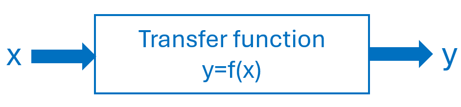
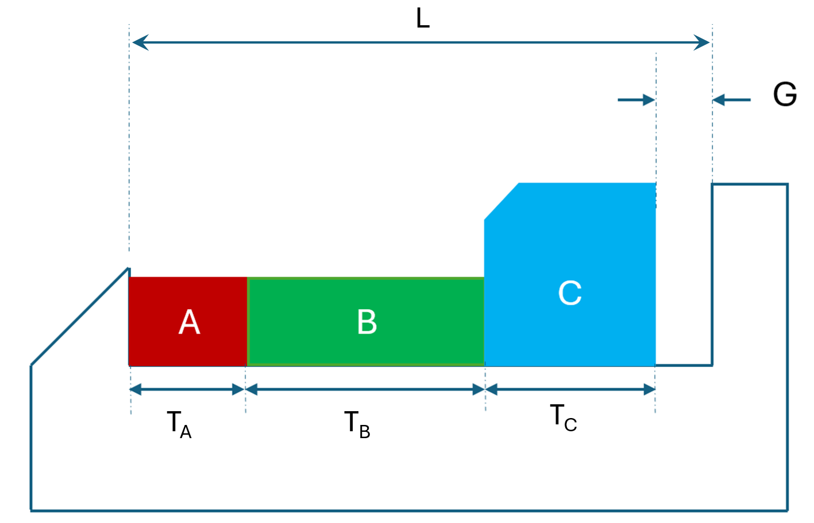
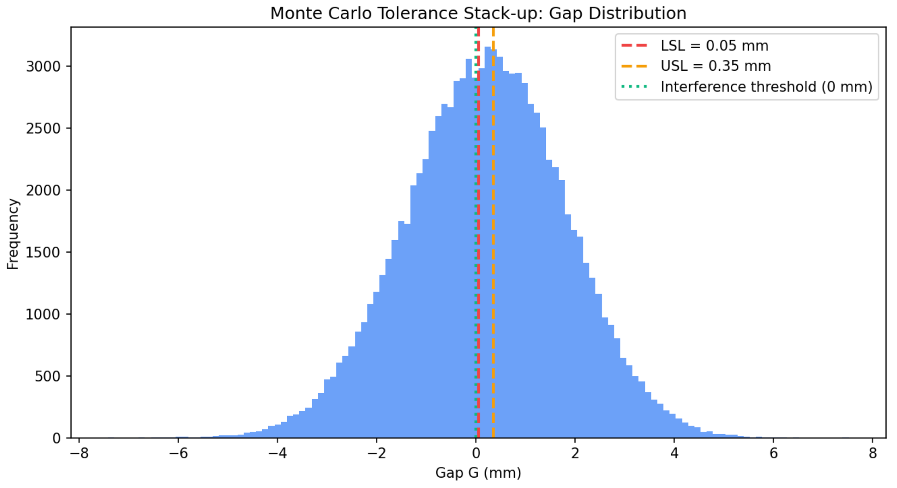

# Monte Carlo Simulation {#ch:MonteCarlo}

<div style="float:right; width:100%; text-align:right; font-style: italic; margin: 20px 0;">

> Being secret, the work required a code name. I suggested 'Monte Carlo' ---after the casino--- since Stan's uncle would borrow money from relatives to gamble.

> Nicholas Metropolis, Los Alamos Recollections
</div>


## Introduction

Monte Carlo simulation is a powerful technique for analyzing systems influenced by uncertainty, it uses repeated random sampling and statistical analysis. This chapter introduces the foundational concepts, methodology, and diverse applications of Monte Carlo simulation [@Raychaudhuri2008].

Monte Carlo simulation is especially valuable for systematic *"what-if"* analysis, allowing experimenters to explore the impact of varying input parameters on model outcomes. Monte Carlo contrasts with deterministic models that use fixed input values that do not capture the risks and variability inherent in real-world scenarios. To apply Monte Carlo, we create a mathematical model that relates the inputs of the system $(x's)$ to one or more outputs of key performance indicators $(y)$^[This mathematical model is called transfer function.]. Monte Carlo can estimate best, worst and more likely scenarios by assigning statistical distributions to the input variables $(x's)$ and drawing random samples from these distributions. Each set of sampled inputs produces a unique outcome, and when repeating this process many times, engineers can build a comprehensive picture of possible results and their associated probabilities of occurrence. @fig-transfer presents this concept.


::: {#fig-transfer}
{width=40% alt="Transfer function diagram showing the relationship between input and output in a simulation model" }

Transfer function representation used in the simulation model.
:::


## Methodology

The steps to perform Monte Carlo simulations are:

1.  **Create a transfer function**. Begin with a deterministic function relating the most likely values for inputs with the output(s): $y=f(x)$.

2.  **Characterize input probability distributions**. Use historical data to fit appropriate probability distributions to each input variable $x$.

3.  **Generate random variates**. Obtain random samples from these distributions to serve as input for the model.

4.  **Analysis and Decision Making**. Collect output data $(y)$ from multiple simulation runs and apply statistical analysis to inform your decisions.

## Output Analysis

After running simulations, output data is analyzed statistically. Key statistics such as mean, median, variance, skewness, and kurtosis are calculated. Frequency histograms and empirical distributions help visualize the range and likelihood of outcomes. The precision of these analyses improves with the number of simulation trials.

## Application Areas

Monte Carlo simulation finds application across diverse fields, some examples are:

- **Finance**: Real options analysis, portfolio evaluation, option pricing, personal financial planning.

- **Reliability Engineering and Six Sigma**: Evaluation of system reliability, prediction of failures, optimization of business processes for quality improvement.

- **Mathematics and Statistical Physics**: Complex integration and optimization problems, including quantum systems and operations research.

- **Engineering**: Tolerance analysis, estimation of project completion risk, inventory cost distributions under uncertain demand.

## Example of MC {#Example .unnumbered}

Consider the assembly in @fig-Tolerance. This is a stack up or gap problem in manufacturing^[Adapted from @Creveling1997.]. The development of a simulation follows.

::: {#fig-Tolerance}
{width=60% alt="Figure showing a stacking diagram of parts and the dimensions of each element." }

Stack up assembly.
:::

1.  **Transfer function:** $$G=L-(T_A +T_B + T_C)$$ where $G$, the Gap, is the response, and $L, T_A, T_B$ and $T_C$ are the $x's$.

2.  **Characterizing the probability distributions for the $x's$**: Each thickness $T_i$; $i=A,B,C$, is a log-normal random variable with mean $E(T_i)$ and coefficient of variation $CV[T_i]$. Where: $$CV=\sqrt{e^{\sigma^2}-1} \Longrightarrow \: \sigma^2 = ln(1+CV^2)$$ and $$E(X)=e^{\mu+\frac{\sigma^2}{2}} \Longrightarrow \: \mu=ln(E(X))-\frac{1}{2} \sigma^2$$ We will select a gap specification: \[LSL, USL\]=\[0.05, 0.35\] and estimate its conformance with Monte Carlo. Dimension of the housing is L=100.

    The mean and coefficient of variance for each part are A=$[\mu=30, CV=0.02]$, B=$[\mu=45, CV=0.03]$, and C=$[\mu=24, CV=0.025]$.

3.  **Generation of random variables and results.** @lst-mchousing
 has the python code that develop the simulation and the variability results of the Gap, our ($y$).

    - Mean gap $\simeq$ 0.1969 mm, $\sigma \simeq$ 1.6005 mm

    - Percentiles: P1 $\simeq -3.60$ mm, P5 $\simeq -2.47$ mm, Median $\simeq$ 0.222 mm, P95 $\simeq$ 2.79 mm, P99 $\simeq$ 3.86 mm.

    - Yield within \[0.05, 0.35\] mm $\simeq$ 7.403%

    - Pr(G$<$LSL) $\simeq$`<!-- -->`{=html}45.809%

    - Pr(G $>$ USL) $\simeq$ 46.788%

    - Pr(G$<0$) (interference) $\simeq$ 44.644%

4.  **Analysis** The yield is unacceptable. Only  7.4% of assemblies will meet the gap requirements. Nearly 45% have interference (G\<$0$), meaning that the stack exceeds the housing length. See @fig-HistoMC.


::: {#fig-HistoMC}
{width=80% alt="Figure showing the histogram of GAP results." }

Distribution of Gap values and comparison with specifications.
:::

Monte Carlo vs. Worst‑Case^[Worst-case tolerance analysis assumes that all individual variations reach their extreme limits at the same time and adds them directly to find the maximum possible deviation.] vs. RSS^[RSS tolerance analysis is a method used to estimate how variations in different parts combine, assuming those variations occur randomly and are unlikely to all happen at their worst value at the same time.]: Monte Carlo provides yield estimates under realistic variability; worst‑case stack‑up is often overly pessimistic, while RSS (root‑sum‑square) is optimistic unless variability is truly normal and small. For production decisions, Monte Carlo is preferred.


::: {#lst-mchousing}

::: {.callout-note title="Listing: Python simulation for Housing and Stacking."}

```python
import numpy as np
import pandas as pd
import matplotlib.pyplot as plt

# -----------------------------
# Monte Carlo tolerance stack-up
# -----------------------------

def lognormal_params_from_mean_cv(m: float, cv: float):
    if m <= 0:
        raise ValueError("Mean must be positive for lognormal.")
    if cv <= 0:
        raise ValueError("CV must be positive for lognormal.")
    sigma2 = np.log(1.0 + cv**2)
    sigma = np.sqrt(sigma2)
    mu = np.log(m) - 0.5 * sigma2
    return mu, sigma

# Scenario parameters
L = 100.00
parts = [
    {"name": "A", "mean": 30.00, "cv": 0.02},
    {"name": "B", "mean": 45.00, "cv": 0.03},
    {"name": "C", "mean": 24.80, "cv": 0.025},
]

LSL = 0.05
USL = 0.35
N = 100000

rng = np.random.default_rng(12345)

samples_per_part = {}
for p in parts:
    mu, sigma = lognormal_params_from_mean_cv(p["mean"], p["cv"])
    samples = rng.lognormal(mean=mu, sigma=sigma, size=N)
    samples_per_part[p["name"]] = samples

stack_sum = sum(samples_per_part[name] for name in samples_per_part)
G = L - stack_sum

mean_gap = float(np.mean(G))

print(f"Mean gap: {mean_gap:.3f}")
```
:::
:::
## Software Tools

MC simulation can be implemented using many programming languages such as Python, R, C, and C++, as well as specialized software packages and spreadsheet add-ins. Tools like Oracle Crystal Ball, \@RISK, and FrontlineSolvers for Excel make MC simulation accessible to a wide audience, enabling users to model uncertainty and analyze outcomes with ease.

## Conclusion

Monte Carlo simulation is an invaluable technique for analyzing uncertain scenarios and making probabilistic decisions. Its simplicity, versatility, and the availability of supporting software have driven widespread adoption across mathematics, engineering, finance, and beyond.

## Questions     

1.  What is Monte Carlo simulation and why is it useful in engineering?

2.  How does Monte Carlo simulation differ from deterministic models?

3.  What is meant by "what-if" analysis in Monte Carlo simulation?

4.  Define a transfer function and explain its role.

5.  Why are probability distributions assigned to input variables?

6.  What is a random variate in the context of Monte Carlo simulation?

7.  Why are multiple simulation runs required?

8.  What types of statistics are used in Monte Carlo output analysis?

9.  Name at least three application areas of Monte Carlo simulation.

10. Why is Monte Carlo preferred over worst-case and RSS methods in tolerance analysis?

## Notes of the Chapter {#notes-of-the-chapter .unnumbered}

- Nicholas Constantine Metropolis (June 11, 1915 -- October 17, 1999) was a Greek-American physicist and one of the founding figures of computational physics and Monte Carlo simulation. Recruited to Los Alamos National Laboratory during the Manhattan Project by J. Robert Oppenheimer, Metropolis played a central role in transforming stochastic sampling from a theoretical idea into a practical computational tool. Along with Stanislaw Ulam, he helped develop and implement the Monte Carlo method. His work laid the foundations of modern simulation, numerical experimentation, and statistical computing used today across science, engineering, and finance. A fun fact about Metropolis: He named Los Alamos's first computer MANIAC (Mathematical Analyzer, Numerical Integrator, and Computer), partly to mock the growing obsession with grand acronyms---much to John von Neumann's disapproval.

## References {#References .unnumbered}