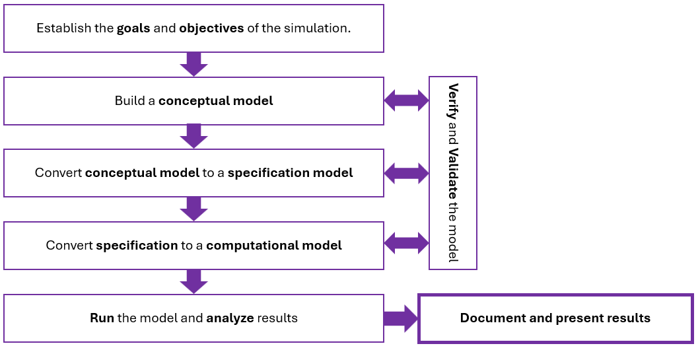

# Building and delivering a Discrete Event Simulation {#ch:DelivSim}

> Competitive strategy is about being different. It means deliberately choosing a different set of activities to deliver a unique mix of value.

> Michael E. Porter.

## Choosing strategic simulation projects

As engineers we build models to understand, create, or improve systems and gain strategic advantages. [@Porter1996] defines strategy as the creation of a *unique* and valuable position through a *distinct set of activities, supported by trade‑offs^[i.e., choosing what not to do]and fit among those activities*. Strategy is fundamentally about being different: either performing different activities than rivals or performing similar activities in different ways^[And it is not just the same as operational effectiveness, which can be easily imitated].

Simulation is a core analytic tool in the IME toolkit and, when implemented correctly, it can create strategic advantage. It does so by translating the organization's strategy into clear objectives and performance measures, building a credible computational model of the system, and running well‑designed experiments that test alternative policies and scenarios. Through rigorous verification and validation, simulation provides decision ready evidence^[From risk and sensitivity insights to
costbenefit tradeoffs.] that helps decision makes choose, prioritize, and implement the actions most likely to deliver sustained performance improvements.

The process of building and delivering a simulation model is presented in @fig-BuildModel^[Adapted from @ParkLeemis_DESAFC_1_1 and @Law2005.].

::: {#fig-BuildModel}
{width=100% alt="Flow diagram showing the recommended steps to build a simulation model."}

Recommended steps to build a simulation model. 
:::

### Goals and objectives of the simulation

Goals define purpose and intended use. They are the high‑level reason for building the model to find out what decisions the simulation project will support and what outcomes stakeholders care about. In credible simulation practice, validity is always judged with respect to this intended use and purpose. Goals answer the question: *why are we simulating?*

Objectives, on the other hand, are specific, measurable targets that quantify the goal^[e.g., they have a key performance indicator (KPI) with a required precision or threshold (SMART: Specific, Measurable, Achievable, Relevant, and Timebound).]. Objectives are derived from stakeholder expectations and are typically expressed as measures of effectiveness (MOE)^[A MOE is a measure by which a stakeholders expectations will be judged in assessing satisfaction with the model produced. MOE’s are usually
quantitative in nature.] and measures of performance (MOP)^[A MOP is a quantitative measure that, when met by the solution model, will help ensure that a stakeholder’s MOE will be satisfied. Note: there is not necessarily a one to one relation between MOE’s and MOP’s.] in systems engineering [@NASA_HDBK_1009A_2025].

A MOE reflects mission success from the stakeholder's point of view. For example: *The model must provide ways to achieve Service Level Agreement compliance $\geq$ 95%.*

The corresponding MOP can be a model output produced by the simulation's event logic^[Arrivals, queuing, start and end of
service.]. In this case: *90th‑percentile customer wait time in the queue (seconds)*. Thus, a MOP above 90th‑percentile wait is one of the levers that enables the previous MOE.

An objective answers the question: *What number or threshold needs to be estimated or met?* Following our example, this could be: Keep the $90th$ *percentile customer wait time* under 15 minutes, with a $95\% CI$ precision of $\pm 1minute$^[Note that, if the purpose is to answer
multiple questions, validity must be
established for each question.]. In summary: objectives must be explicit and traceable.

Goals and objectives drive the questions a simulation model must answer and the methodology of its construction:

1.  **Start with the decision to make, then derive measurable criteria**. In systems engineering, these criteria are Measures of Effectiveness (MOEs) and Measures of Performance (MOPs).

2.  **Use goals and objectives to create questions that scope the model and experiments to perform on it.**

    a)  Translate each MOE/MOP to specific questions relevant for decision making. Some examples:

        - *If we add two resources per shift, does the $90th$ percentile wait drops below 2 minutes?*

        - *What staffing minimizes cost while maintaining a service level agreement $\geq 95 \%$ with our clients?*

    b)  Scope the model and experiments to perform. Decide which elements of the real model need to be represented, which inputs and operations require distributions, what scenarios to run, the precision required^[Confidence levels, half-width, run length, warm up, etc.]. This step will keep the model parsimonious yet fit for its intended use.

3.  **Build three model levels: Conceptual, Specification, and Computational, with proper Validation and Verification (V&V):**

    a)  Conceptual model (On paper ideas): The deliverables are scope, boundaries, entities, resources, queues, policies, state variables, and assumptions linked to specific questions to answer, as well as the MOE/MOP they support. A stakeholder‑oriented description that explains what a system will do, why, when, where, and how it will be operated in its intended environment, without prescribing detailed design. Early V&V activities are:

        - Conceptual model validity: Stakeholder reviews plus documentation written assumptions, as well as a structured calendar of reviews.

        - Traceability: Verification of the linkage Goal $\rightarrow$ Objective $\rightarrow$ Question $\rightarrow$ Conceptual elements^[Entities, processes, resources, etc.].

        **Deliverables**: High level diagram of the model, scope and assumptions list, entity/state/resources tables, and catalog of MOE/MOP.

    b)  Specification model (On-paper details): A formalization of data sources, distributions, parameters, event rules, routing priorities, logic over time, and experimental design approach. Related V&V activities are:

        - Data validity and input modeling: Fit tests, stationarity; Experimental design arrays and precision planning^[Scenarios, warm up, run length. replications, output statistics tied to MOE/MOPs.].

        - Specification reviews: pseudo-code, flow charts, sequence of events verified against conceptual logic; unit consistency, dimensions, and measurement definitions.

        **Deliverables**: Input models^[Fitted distributions.], event tables, DOE plan, KPI with CI definitions, and verification test cases.

    c)  Computational model (executable in platform): This is the implementation in a simulation platform or computer language^[Simio, AnyLogic, Arena, Python, R, C++, etc.], including: PRNG seed control, instrumentation^[Collection of statistics.], scenario library, and report templates that produce MOE/MOP aligned outputs. Related V&V activities are:

        - Verification^[Activities performed to answer the question Does the code implement the specification?]: White box/trace checks, extreme case tests, conservation of flow checks^[A conservation of flow test checks that your simulation is not losing or creating entities as they move through the model.], debugging with event traces.

        - Validation^[Activities performed to answer the question: Does the model answers the purpose?]: Comparison of model outputs with real system history, face validation with subject matter experts, sensitivity and plausibility checks.

4.  **Conduct and analyze scenarios: Answer questions.**

    - For each model scenario of interest, run the model as planned^[Run length, warm up period, number of independent model replications.].

    - Analyze the results and decide if additional experiments are required to answer the questions.

5.  **Document and present the results of your simulation.**

    - Documentation for the model, and the associated simulation study, must include the conceptual model^[This is critical for future reuse of the model.], a detailed description of the computer program, and results. **Deliverable**: Simulation paper.

    - Present the animation and results of the simulation including a brief discussion of its validation to assure model credibility. **Deliverable**: Slide dock and in-person presentation to stakeholders.

### A note on Verification and Validation

Simulation verification answers the question: *Did we build the model right?* It is checking if the app or computer program faithfully implements the specified model. The deliverables are correct logic, code, and data flow [@NASA_Product_Verification_5_3].

Simulation validation answers the question: *Did we build the right model*^[For the specified purpose.]. Validation is about demonstrating the model is an accurate representation of the system, for the intended use. It is often done by comparing the model to real data, subject matter experts, or accepted analytical results [@NASA_Product_Validation_5_4].

Verification and validation are distinct, complementary processes: verification ties code to the conceptual model; validation ties the model to the real world and intended decisions. Treating them separately helps avoid models that are *correctly coded but wrong for the question*, or *conceptually sound but incorrectly implemented* [@Sargent2013].

## Simulation and optimization

Why Simulation is not optimization? Simulation is a technique for generating sample outcomes of a system based on random inputs and specified rules. It allows you to:

- Estimate performance measures^[e.g., average waiting time, throughput,
risk.].

- Analyze variability and uncertainty.

- Compare alternative system designs or scenarios.

Optimization, on the other hand, is a mathematical process that seeks to find the best solution^[maximum, target, minimum.] for a given objective function, often subject to constraints.

The key distinction is:

- Simulation tells you *what happens if...* for a given set of inputs.

- Optimization tells you *what is the best way to...* achieve a goal.

## Joint use of Simulation and Optimization

When a simulation uses an optimization tool^[Like OPTSIM or OPTQUEST.], then there is a combination of simulation with optimization. In these cases, simulation is used to evaluate the performance of different solutions, and optimization algorithms guide the search for the best solution.

How it works:

- The optimization algorithm proposes a set of input parameters or system configurations.

- The simulation model evaluates each proposal, estimating its performance.

- The optimization algorithm uses these results to update its search and move toward better solutions.

This approach is called simulation-based optimization or optimization via simulation. It is widely used when the system is too complex for analytical optimization, or when the objective function can only be evaluated through simulation[@Azadivar1992], [@Banks1998].

## Questions

1.  What is the role of simulation in creating strategic advantage?

2.  According to Porter, what defines strategy in an organization?

3.  What is the difference between strategy and operational effectiveness?

4.  Why is simulation considered a core tool in Industrial and Manufacturing Engineering?

5.  What is meant by "decision-ready evidence" in simulation studies?

6.  Define the difference between goals and objectives in simulation projects.

7.  What is a Measure of Effectiveness (MOE)?

8.  What is a Measure of Performance (MOP)?

9.  Explain the relationship between MOE and MOP.

10. What is meant by traceability in simulation modeling?

11. What are the three levels of simulation modeling?

12. What is the purpose of the conceptual model?

13. What are the key deliverables of the conceptual model?

14. What is included in a specification model?

15. What is the role of the computational model?

16. What is verification in simulation?

17. What is validation in simulation?

18. Explain the difference between simulation and optimization.

19. What is simulation-based optimization?

20. Why is combining simulation and optimization useful in complex systems?

## Notes of the Chapter {#notes-of-the-chapter .unnumbered}

- Michael Eugene Porter (born May 23, 1947, in Ann Arbor, Michigan) is the Harvard Business School economist famous for shaping modern competitive strategy, especially through Porter's Five Forces and the value chain, and for founding the Monitor Group and co-founding FSG (originally Foundation Strategy Group). A funny fact: Porter says his interest in competition started with sports: he was on Princeton's NCAA championship golf team before turning to business strategy.

## References {#References .unnumbered}